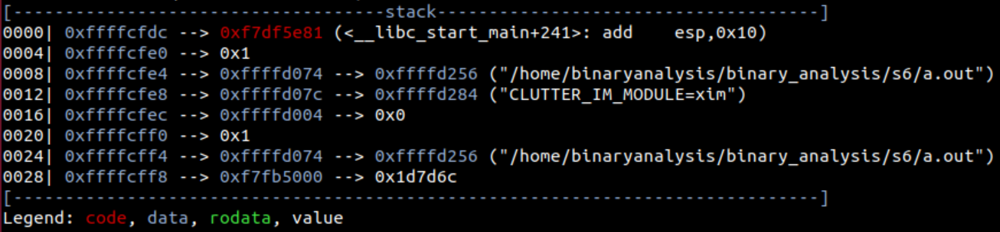
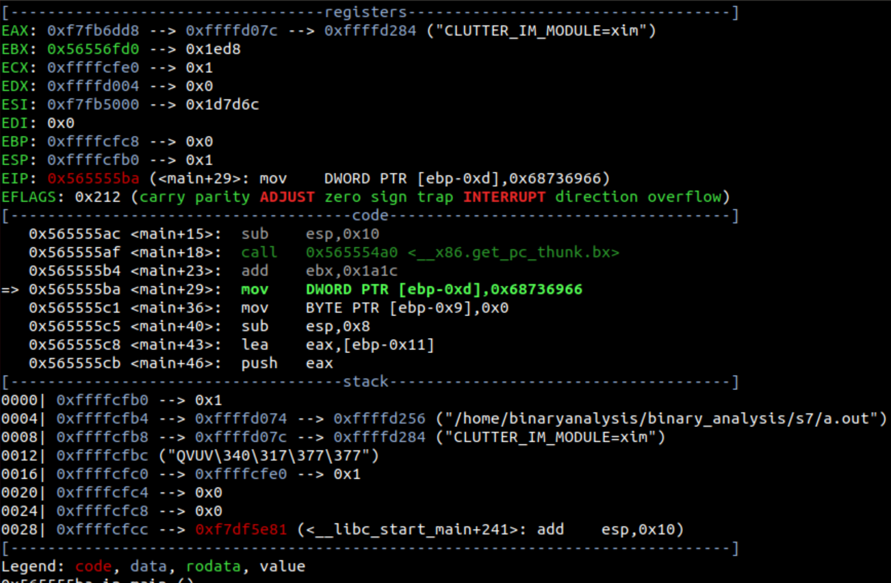
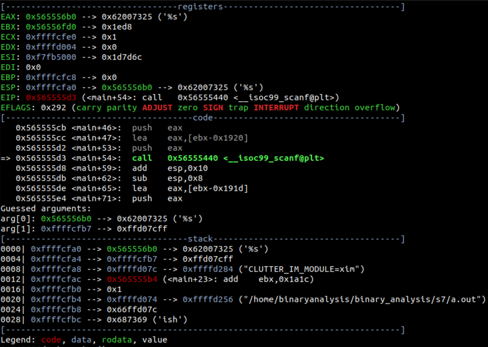

# はじめて学ぶバイナリ解析
- gdb-pedaの表示の見方
	- スタック領域(---stack---)
		- 
		- 0000や0004はESPからの相対的なアドレスである(32ビット実行環境なので4ずつ増えていく)
		- 0xffffcfdcや0xffffcfe0はスタックのアドレスである
		- 0xffffcfdc --> 0xf7df5e81は0xffffcfdcに格納されている値が0xf7df5e81であることを意味する
			- ```
			  gdb-peda$ x/4bx 0xffffcfdc
			  0xffffcfdc: 0x81 0x5e 0xdf 0xf7
			  ```
		- 0xffffcfe4 --> 0xffffd074 --> 0xffffd256は0xffffcfe4に格納されている値が0xffffd074で、0xffffd074に格納されている値が0xffffd256であることを意味する
			- ```
			  gdb-peda$ x/4bx 0xffffcfe4
			  0xffffcfe4: 0x74 0xd0 0xff 0xff
			  gdb-peda$ x/4bx 0xffffd074
			  0xffffd074: 0x56 0xd2 0xff 0xff
			  ```
		- プログラム部のアドレスと推測された場合は赤文字で、スタック領域のアドレスと推測された場合は青文字で表示される(一番左の青文字はスタック領域のアドレスで確定だが、-->の先は推測でしかない)
- stack <スタック数>でスタック領域を表示することも出来る
- バッファオーバーフローについてスタック領域に着目する
	- ```c
	  #include <stdio.h>
	  #include <string.h>
	  
	  int main() {
	    char str[] = "fish";
	    char buf[4];
	    scanf("%s", buf);
	    if (strcmp(str, "beef") == 0) {
	      printf("hacked!\n");
	    } else {
	      printf("failed!\n");
	    }
	  }
	  ```
	- 上のコードで標準入力にabcdbeefを渡すとバッファオーバーフローによってhacked!が出力される
	- 
	- mov DWORD PTR [ebp-0xd], 0x68736966は、char str[] = "fish";に対応するアセンブリである
	- EBPが0xffffcfc8なので、これから0xdを引いた0xffffcfbbを始点にfishが格納されている
		- ```
		  gdb-peda$ x/4bx 0xffffcfbb
		  0xffffcfbb: 0x66 0x69 0x73 0x68
		  ```
	- 
	- call 0x56555440 \<__isoc99_scanf@plt>を実行すると入力を求められるので、abcdと入力する
	- 入力後にスタック領域を確認すると、0xffffcfb7を始点にabcdが格納されている
		- ```
		  gdb-peda$ x/4bx 0xffffcfb7
		  0xffffcfb7: 0x61 0x62 0x63 0x64
		  ```
	- 先ほどfishが格納されていた0xffffcfbb ~ 0xffffcfbeを確認する
		- ```
		  gdb-peda$ x/4bx 0xffffcfbb
		  0xffffcfbb: 0x00 0x69 0x73 0x68
		  ```
		- 0xffffcfbbが0x00に変わってしまっている(scanfは末尾にヌルバイトを書き込む？)