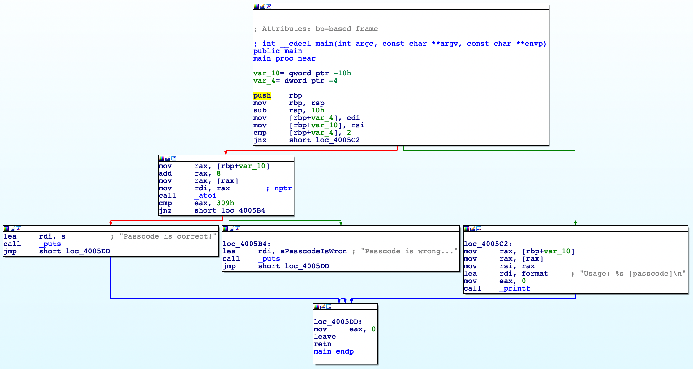
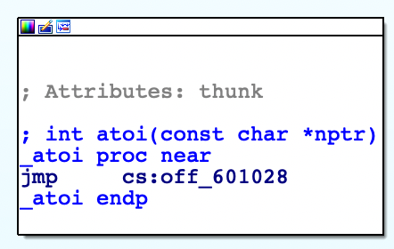
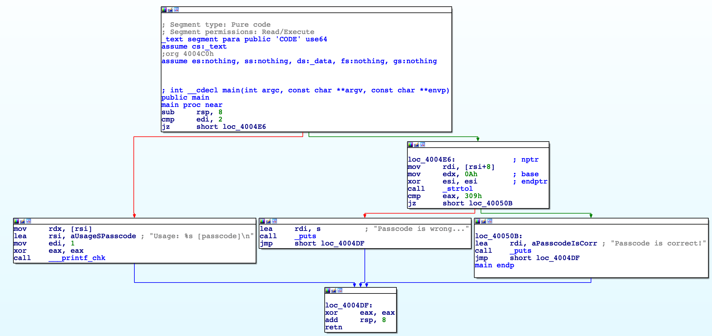
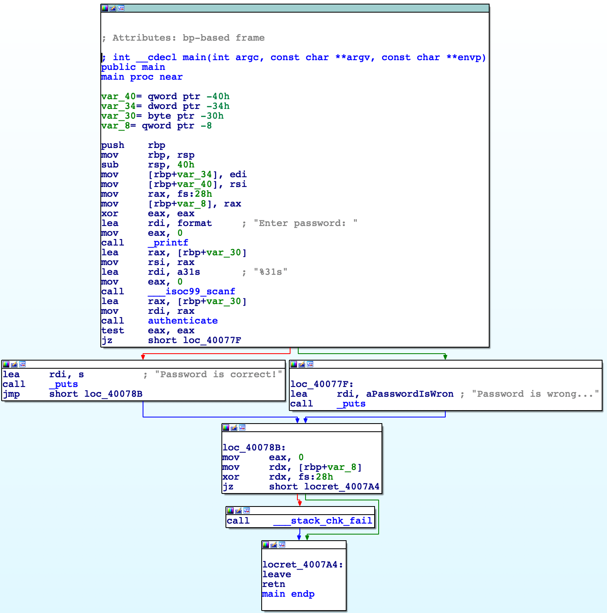
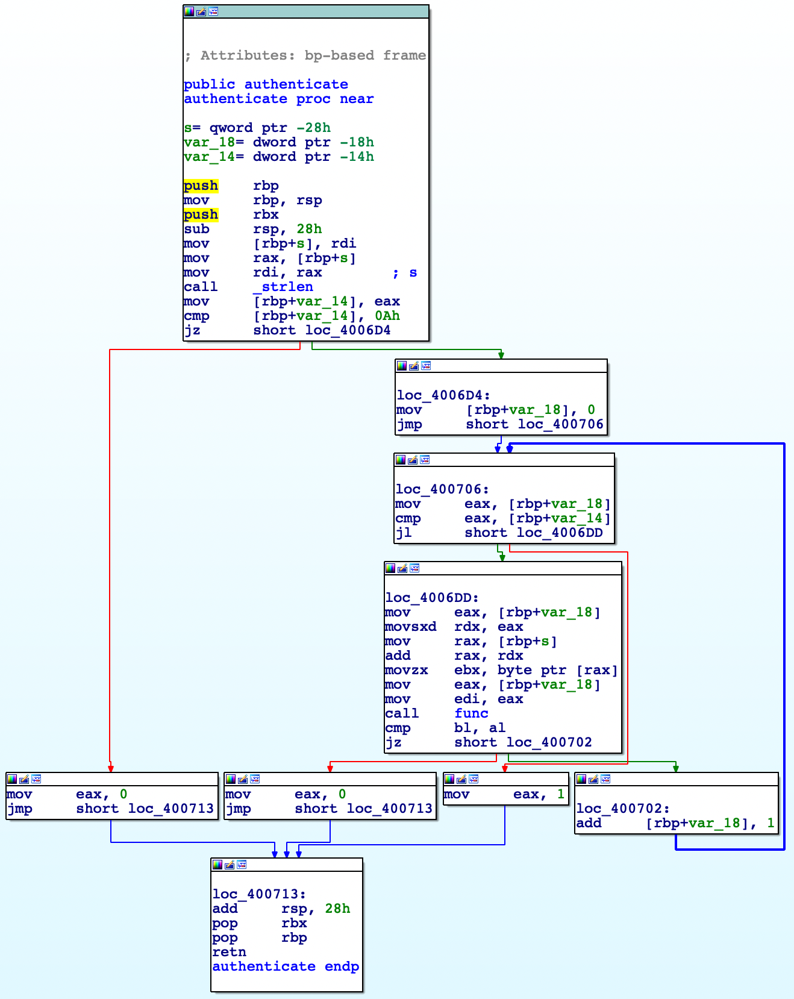
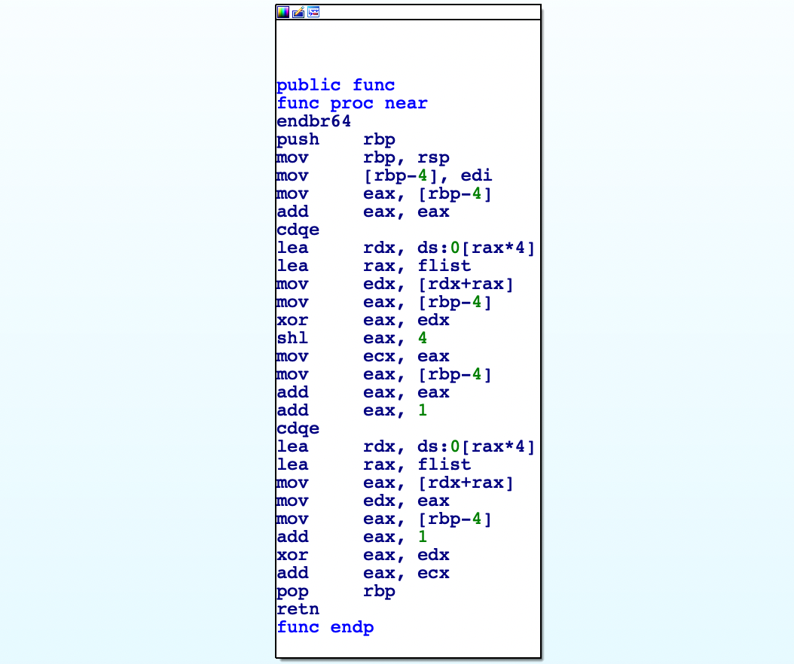

# 詳解セキュリティコンテスト
- ## Part4 Reversing
- ### 26章 静的解析に触れてみよう
	- まず ((6571c4f4-dec8-4923-907f-a5093d11a3ca)) をする
	- IDAを使った静的解析
		- 
			- Graph Viewという画面
				- これはmain関数のGraph Viewで、他の関数のGraph Viewも確認出来る
			- 各ブロックはjmpやjnzなどの分岐命令を区切りに分かれている
			- 緑の矢印が条件に一致する時のジャンプ、赤の矢印が条件に一致しない時のジャンプを表している
			- sub rsp, 10h は sub rsp, 0x10と同じ([参考](https://stackoverflow.com/questions/3030959/what-does-the-h-suffix-mean))
			- mov [rbp+var_4], ediとmov [rbp+var_10], rsiは、それぞれmain関数の第一引数argcと第二引数argvをメモリに格納している
				- var_4とvar_10はIDAが認識したローカル変数
					- mov [rbp+var_4], ediはmov DWORD PTR -4[rbp], edi
					- mov [rbp+var_10], rsiはmov QWORD PTR -16[rbp], rsi
					- 変数名を右クリックしてRenameを選択すると、名前を変えることが出来る
				- argcとargvについて([参考](https://qiita.com/keitean/items/1a79c96adcf3fc02b1e5))
					- ```c
					  #include <stdio.h>
					  
					  int main(int argc, char* argv[]) {
					      printf("argc=%d\n", argc);
					      printf("argv[0]=%s\n", argv[0]);
					      printf("argv[1]=%s\n", argv[1]);
					      printf("argv[2]=%s\n", argv[2]);
					  }
					  ```
					- ```
					  $ ./a.out 100 abc
					  argc=3
					  argv[0]=./a.out
					  argv[1]=100
					  argv[2]=abc
					  ```
					- argcとargvがどう格納されているのかをgdbで確認する
					- gdb --args a.out 100 abcを実行する([参考](https://qiita.com/ydah/items/7bb22df65ed61efdd5de))
					- ```
					  => 0x555555555155 <main+12>:	mov    DWORD PTR [rbp-0x4],edi
					     0x555555555158 <main+15>:	mov    QWORD PTR [rbp-0x10],rsi
					  ```
					- この時、rsiとrdiは以下のようになっている
						- ```
						  RSI: 0x7fffffffe4c8 --> 0x7fffffffe72d ("/home/ubuntu/ctfbook/rev/04_static/a.out")
						  RDI: 0x3
						  ```
					- rsi(0x7fffffffe4c8)周りを確認
						- ```
						  gdb-peda$ x/24bx 0x7fffffffe4c8
						  0x7fffffffe4c8:	0x2d	0xe7	0xff	0xff	0xff	0x7f	0x00	0x00
						  0x7fffffffe4d0:	0x56	0xe7	0xff	0xff	0xff	0x7f	0x00	0x00
						  0x7fffffffe4d8:	0x5a	0xe7	0xff	0xff	0xff	0x7f	0x00	0x00
						  ```
					- 0x7fffffffe4c8には0x7fffffffe72dが格納されている
						- 0x7fffffffe72dには"/home/ubuntu/ctfbook/rev/04_static/a.out"という文字列が格納されている
							- ```
							  gdb-peda$ x/40bx 0x7fffffffe72d
							  0x7fffffffe72d:	0x2f	0x68	0x6f	0x6d	0x65	0x2f	0x75	0x62
							  0x7fffffffe735:	0x75	0x6e	0x74	0x75	0x2f	0x63	0x74	0x66
							  0x7fffffffe73d:	0x62	0x6f	0x6f	0x6b	0x2f	0x72	0x65	0x76
							  0x7fffffffe745:	0x2f	0x30	0x34	0x5f	0x73	0x74	0x61	0x74
							  0x7fffffffe74d:	0x69	0x63	0x2f	0x61	0x2e	0x6f	0x75	0x74
							  ```
					- 0x7fffffffe4d0には0x7fffffffe756が格納されている
						- 0x7fffffffe756には"100"という文字列が格納されている
							- ```
							  gdb-peda$ x/3bx 0x7fffffffe756
							  0x7fffffffe756:	0x31	0x30	0x30
							  ```
							- 数値としてではなく文字列として格納されている
					- 0x7fffffffe4d8には0x7fffffffe75aが格納されている
						- 0x7fffffffe75aには"abc"という文字列が格納されている
							- ```
							  gdb-peda$ x/3bx 0x7fffffffe75a
							  0x7fffffffe75a:	0x61	0x62	0x63
							  ```
					- 各文字列はヌルバイト区切りで格納されている
						- ```
						  gdb-peda$ x/48bx 0x7fffffffe72d
						  0x7fffffffe72d:	0x2f	0x68	0x6f	0x6d	0x65	0x2f	0x75	0x62
						  0x7fffffffe735:	0x75	0x6e	0x74	0x75	0x2f	0x63	0x74	0x66
						  0x7fffffffe73d:	0x62	0x6f	0x6f	0x6b	0x2f	0x72	0x65	0x76
						  0x7fffffffe745:	0x2f	0x30	0x34	0x5f	0x73	0x74	0x61	0x74
						  0x7fffffffe74d:	0x69	0x63	0x2f	0x61	0x2e	0x6f	0x75	0x74
						  0x7fffffffe755:	0x00	0x31	0x30	0x30	0x00	0x61	0x62	0x63
						  ```
			- cmp [rbp+var_4], 2; jnz short loc_4005C2;
				- argcが2じゃなかったらジャンプする
				- ジャンプ先ではUsageを表示する
				- shortが何なのかは不明
			- mov rax, [rbp+var_10]; add rax, 8; mov rax, [rax];
				- raxに第一引数を格納している
			- mov rdi, rax; call _atoi;
				- 関数呼び出しのためにrdiレジスタに値を格納している
				- atoiは文字列を数値に変換する関数
			- cmp eax, 0x309; jnz short loc_4005B4;
				- eaxはatoiの戻り値
				- 0x309(=777)と等しくない場合はジャンプする
			- lea rdi, s; call _puts;
				- sはIDAが付けた名前(IDAは文字列に勝手に名前を付ける)
	- 動的リンクと静的リンク
		- atoiのGraph Viewを見ても中身が全然無い
			- {:height 195, :width 278}
		- これは動的リンクでコンパイルされたからである
		- 静的リンクではatoiなどの外部の関数の処理もバイナリに含められるが、動的リンクでは実行する段階で外部ライブラリを読み込んで使えるようにする
		- 静的リンクのメリットは、ライブラリが無い環境でも動作すること
		- 動的リンクのメリットは、ファイルサイズが小さくなること、外部ライブラリにバグが見つかっても再コンパイルの必要がないこと
	- 実行速度に関して最適化されたプログラムとの比較
		- 
		- push rbp; mov rbp, rsp;をしていないので、関数の最後にleaveも実行していない
		- ediとrsiをメモリに格納していない
			- cmp [rbp+var_4], 2がcmp edi, 2になっていて、メモリアクセスが発生しない
		- atoiではなく[strtol](http://www9.plala.or.jp/sgwr-t/lib/strtol.html)を使っている
			- atoiはstrtolを呼ぶだけの実装になっていて、strtolを呼ぶ方が速い
		- pritnfではなく[__printf_chk](https://refspecs.linuxbase.org/LSB_4.1.0/LSB-Core-generic/LSB-Core-generic/libc---printf-chk-1.html)を使っている
			- 最適化とは関係なく、gccに-O3というオプションを渡してコンパイルすると、FORTIFYというセキュリティ機能が有効になり、printfの安全版である_\_printf_chkが使われるようになる(他にも_\_strcpy_chkや_\_gets_chkなどがある)
		- ローカル変数が使われていないので、sub rsp, 8は省略して良さそうだが、x86-64のアラインメント制約から必要([参考](https://xtech.nikkei.com/it/article/COLUMN/20070509/270418/))
			- 理解出来てないのでまた今度
- ### 27章 動的解析を組み合わせよう
	- 静的解析から始める
		- {:height 539, :width 483}
			- __isoc99_scanfで標準入力を読み込む
				- 第一引数は%31s (最大31文字の文字列を読み込む)
				- 第二引数は読み込む文字列を格納するポインタ
			- authenticateに読み込んだ文字列を渡す
			- authenticateの返り値が0じゃなければ"Password is correct!"が出力される
		- {:height 698, :width 413}
			- strlenでpasswordの長さがeaxに格納される
			- passwordの長さを0x0Aと比較している
				- 異なる場合、eaxが0となるブロックに進むため、passwordの長さは10である必要がある
			- [rbp+var_18]をループ変数として、passwordの長さ分ループしている
			- movzx ebx, byte ptr [rax]でpassword[i]を32ビットに符号拡張して、ebxに格納している
			- ループ変数を第一引数にしてfuncを呼んでいる
			- funcの戻り値の下位1バイトとpassword[i]が一致していなかったらループを抜けて、eaxが0になる
			- :を押すと命令にコメントを追加することが出来る
				- ;を押すとrepetable commentを追加することが出来る([参考](https://hex-rays.com/blog/igor-tip-of-the-week-14-comments-in-ida/))
		- 後はfuncの中身を静的解析すれば正しいpasswordが分かるが、動的解析だともっと楽に分かる
	- gdbを使った動的解析
		- ブレークポイントをcmp bl, alに設定する
			- ```
			  gdb-peda$ b *0x555555555271
			  Breakpoint 1 at 0x555555555271
			  ```
				- *を付けるのに注意
				- アドレスはIDAで調べることが出来る
		- ブレークポイントの確認とブレークポイントの削除
			- ```
			  gdb-peda$ info breakpoints
			  Num     Type           Disp Enb Address            What
			  1       breakpoint     keep y   0x0000555555555271
			  2       breakpoint     keep y   0x0000000000000001
			  gdb-peda$ delete 2
			  gdb-peda$ info breakpoints
			  Num     Type           Disp Enb Address            What
			  1       breakpoint     keep y   0x0000555555555271
			  ```
		- 以下の手順で正しいパスワードが分かる
			- ```
			  gdb-peda$ r
			  Starting program: /home/ubuntu/ctfbook/rev/05_dynamic/a.out
			  Enter password: 0123456789
			  
			  [----------------------------------registers-----------------------------------]
			  RAX: 0x68 ('h')
			  ...
			  [-------------------------------------code-------------------------------------]
			     0x555555555267 <authenticate+70>:	mov    eax,DWORD PTR [rbp-0x18]
			     0x55555555526a <authenticate+73>:	mov    edi,eax
			     0x55555555526c <authenticate+75>:	call   0x5555555551c9 <func>
			  => 0x555555555271 <authenticate+80>:	cmp    bl,al
			  gdb-peda$ set $bl = 0x68
			  gdb-peda$ c
			  Continuing.
			  [----------------------------------registers-----------------------------------]
			  RAX: 0x69 ('i')
			  ...
			  [-------------------------------------code-------------------------------------]
			     0x555555555267 <authenticate+70>:	mov    eax,DWORD PTR [rbp-0x18]
			     0x55555555526a <authenticate+73>:	mov    edi,eax
			     0x55555555526c <authenticate+75>:	call   0x5555555551c9 <func>
			  => 0x555555555271 <authenticate+80>:	cmp    bl,al
			  gdb-peda$ set $bl = 0x69
			  gdb-peda$ c
			  ...
			  ```
			- alとblが一致していないとループを抜けてしまうため書き換えている
		- 上記の手順はgdbスクリプトで自動化することが出来る
			- ```python
			  import gdb
			  
			  gdb.execute('b *0x555555555271')
			  gdb.execute('r')
			  
			  password = ''
			  
			  for i in range(10):
			      al = gdb.parse_and_eval('$al')
			      password += chr(al)
			  
			      gdb.execute(f'set $bl = {al}')
			      gdb.execute('c')
			  
			  print(password)
			  ```
			- gdb a.out -x solve.pyとしてgdbを実行する
	- gdbの仕組み
		- ptraceとint3命令を使っている
		- ptraceは別のプロセスのメモリやレジスタを取得・変更など、外部から実行を制御するためのシステムコール
		- int3命令はSIGTRAPというシグナルを発生させる命令で、通常はこれが発生するとプログラムが強制終了するが、これを捕捉することでint3が実行された箇所でプログラムを一時停止出来る
		- ブレークポイントを設定すると、そのブレークポイントの命令を保存しておき、int3に書き換える
		- 再度実行を始める時にripからどのブレークポイントで止まったかを調べ、int3から保存しておいた命令に戻す
	- 実践問題
		- funcの静的解析
			- {:height 331, :width 360}
			- lea rdx, ds:0[rax\*4]はlea rdx, [0+rax*4]をIDAが表記したもの([参考](https://reverseengineering.stackexchange.com/questions/18817/lea-instruction-on-datasegment))
			- flistはグローバル変数とのこと
			- lea rdx, ds:0[rax\*4]の*4からflistがint型の配列であると予想が出来る
			- funcは以下のような関数である
				- ```c
				  int func(int i) {
				      return ((i ^ flist[2*i]) << 4) + (flist[2*i+1] ^ (i+1));
				  }
				  ```
			- flistの中身はアセンブリを確認すると書いてある
				- ```
				  flist:
				  	.long	6
				  	.long	9
				  	.long	7
				  	.long	11
				      ...
				  ```
				- int型なのにlongって書いてある