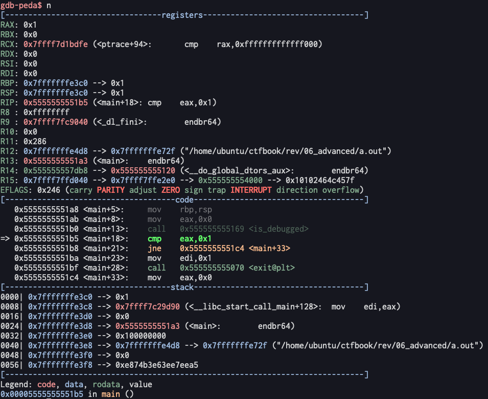

# 詳解セキュリティコンテスト
- ## Part4 Reversing
- ### 28章 プログラムにパッチを当てる
	- IDAを使ってパッチを当てることが出来る
		- 書き換えたい命令をクリックして、画面上部のEdit → Patch program → Assembleを選択
			- 命令を書き換えてOKを押す
			- 次の命令を書き換えるダイアログが出てくるので、Cancelを押す
		- 本には「IDAには、パッチを当てたバイナリを出力する機能は備わっていない」と書いてあるが、Edit → Patch program → Apply patches to input fileで可能([参考](https://medium.com/@k_kisanak/binary-patching-with-ida-pro-part-1-c806d0f20d22))
			- Start EAとEnd EAが何なのか分からないが無視して良さそう(EAはEffective Addressの略とか？)
		- どうやらAssembleオプションには不備があるようなので、可能ならばChange bytesで書き換えた方が良い([参考](https://stackoverflow.com/questions/24294095/ida-invalid-operand-error-when-patching))
	- DIFファイルの適用
		- 本には差分ファイル(DIFファイル)を出力して、このDIFファイルをPythonで適用させる方法が書かれている
		- DIFファイルの出力
			- 画面上部のFile → Produce File → Create DIF File
			- DIFファイルの内容
				- ```
				  $ cat a.dif
				  This difference file has been created by IDA
				  
				  a.out
				  00000000000012F2: 74 75
				  ```
			- 00000000000012F2は変更箇所のオフセット、74は変更前のバイト、75は変更後のバイト
				- {:height 207, :width 483}
		- DIFファイルを適用するPythonプログラム
			- ```python
			  import sys
			  import re
			  
			  def patch(target, diff, rollback=False):
			      for line in diff.split('\n'):
			          r = re.findall(r'([0-9A-Fa-f]+): ([0-9A-Fa-f]{2}) ([0-9A-Fa-f]{2})', line)
			  
			          if len(r) == 1:
			              offset, before, after = map(lambda x: int(x, 16), r[0])
			  
			              if rollback:
			                  target = target[:offset] + bytes([before]) + target[offset+1:]
			              else:
			                  target = target[:offset] + bytes([after]) + target[offset+1:]
			  
			      return target
			  
			  if __name__ == '__main__':
			      if len(sys.argv) < 3:
			          print(f'Usage: {sys.argv[0]} binary diff [restore]')
			          sys.exit(1)
			      else:
			          try:
			              with open(sys.argv[1], 'rb') as f:
			                  target = f.read()
			          except:
			              print(f'[-] {sys.argv[1]}: No such file')
			              sys.exit(1)
			  
			          try:
			              with open(sys.argv[2], 'r') as f:
			                  diff = f.read()
			          except:
			              print(f'[-] {sys.argv[1]}: No such file')
			              sys.exit(1)
			  
			          if len(sys.argv) >= 4 and sys.argv[3] == 'restore':
			              target = patch(target, diff, True)
			              print('[+] patch: Successfully restored')
			          else:
			              target = patch(target, diff, False)
			              print('[+] patch: Successfully modified')
			  
			          with open(sys.argv[1], 'wb') as f:
			              f.write(target)
			  ```
			- open関数に'rb'を渡してバイナリファイルを読み込む
			- DIFファイルを1行ずつ読んでいって、変更行を反映している
	- アンチデバッグ
		- 動的解析を防ぐ仕組み
		- ptraceを使う
			- gdbなどのデバッガはptraceを使って、解析対象のプログラムが動いているプロセスにアタッチ(接続)している
			- 既に別のプロセスにアタッチされているとptraceは失敗する
			- プログラムがptraceで自身にアタッチしようとした時、ptraceが失敗したらデバッガによって解析されていると判断出来る
			- ```c
			  #include <sys/ptrace.h>
			  #include <stdlib.h>
			  
			  int is_debugged() {
			      if (ptrace(PTRACE_TRACEME, 0, 1, 0) == -1) {
			          return 1;
			      } else {
			          return 0;
			      }
			  }
			  
			  int main() {
			      if (is_debugged() == 1) {
			          exit(1);
			      }
			  }
			  ```
			- gdbで確認すると、is_debugged関数の終了後にraxに0x01が入っている
				- {:height 460, :width 540}
		- procfsを使う
			- procfsとは、動いているプロセスに関する情報が記載されたファイルシステム
			- 自身のプロセスに関する情報は/proc/selfにある(どういう仕組み？) ([参考](https://qiita.com/mizutoki79/items/de7d4818a21378820eef))
			- 特に/proc/self/statusのTracerPidには、自身のプロセスに現在アタッチしている別のプロセスの番号が書かれている
			- アタッチされていないと0が書かれているが、gdbなどにアタッチされているとgdbのプロセス番号が書かれている
			- この値をプログラム中から調べることで、動的解析を検出出来る(やり方は調べてない)
		- どちらの方法もパッチを当てれば突破出来る
	- 難読化
		- 静的解析やパッチを当てるのを困難にする仕組み
		- パッカー(Packer)を使う
			- パッカーによって作成された実行ファイルには以下が含まれる([参考](https://xtech.nikkei.com/atcl/nxt/mag/nnw/18/111900071/052100019/))
				- 圧縮された元の実行ファイル
				- 圧縮された元の実行ファイルを展開して実行するコード(展開コード)
				- 展開コードを呼び出す処理を記述したコード(これを起点として実行される)
			- マルウェア開発者からすると、実行ファイルが圧縮されるため、セキュリティソフトのシグネチャを用いた検知を回避することが出来る
			- 代表的なパッカーとしてUPXがある
				- sudo apt-get install -y upxでインストール
			- upx <実行ファイル>で圧縮、upx -d <実行ファイル>で元に戻す
				- ```
				  $ cp /bin/cat ./cat
				  $ upx cat
				                         Ultimate Packer for eXecutables
				                            Copyright (C) 1996 - 2020
				  UPX 3.96        Markus Oberhumer, Laszlo Molnar & John Reiser   Jan 23rd 2020
				  
				          File size         Ratio      Format      Name
				     --------------------   ------   -----------   -----------
				       35280 ->     15612   44.25%   linux/amd64   cat
				  
				  Packed 1 file.
				  $ upx -d cat
				                         Ultimate Packer for eXecutables
				                            Copyright (C) 1996 - 2020
				  UPX 3.96        Markus Oberhumer, Laszlo Molnar & John Reiser   Jan 23rd 2020
				  
				          File size         Ratio      Format      Name
				     --------------------   ------   -----------   -----------
				       35280 <-     15612   44.25%   linux/amd64   cat
				  
				  Unpacked 1 file.
				  ```