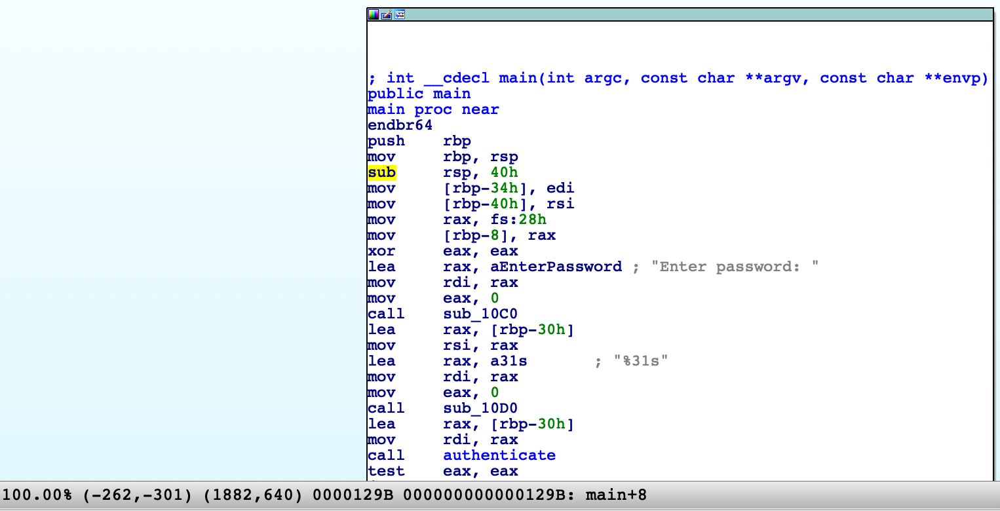

# 詳解セキュリティコンテスト
- ## Part4 Reversing
- ### 28章 プログラムにパッチを当てる(続き)
	- PIE(Position Independent Executable)
		- ASLR(Address Space Layout Randomization)
			- プログラムを実行するごとにスタックやヒープ、共有ライブラリをメモリ上にランダムに配置する仕組み
			- OSのセキュリティ機構として提供されていて、sysctl kernel.randomize_va_space で確認できる(0が無効で、1と2が有効)
				- ```
				  $ sysctl kernel.randomize_va_space
				  kernel.randomize_va_space = 2
				  ```
		- PIEはスタックやヒープ、共有ライブラリに加えてプログラム部(テキスト領域)のアドレスもランダムに配置する仕組み
		- gccでは-no-pieオプションをつけることで、PIE無効でコンパイルすることが出来る
		- PIE無効の場合
			- ```
			  [-------------------------------------code-------------------------------------]
			     0x401280 <main>:	endbr64
			     0x401284 <main+4>:	push   rbp
			     0x401285 <main+5>:	mov    rbp,rsp
			  => 0x401288 <main+8>:	sub    rsp,0x40
			     0x40128c <main+12>:	mov    DWORD PTR [rbp-0x34],edi
			     0x40128f <main+15>:	mov    QWORD PTR [rbp-0x40],rsi
			     0x401293 <main+19>:	mov    rax,QWORD PTR fs:0x28
			     0x40129c <main+28>:	mov    QWORD PTR [rbp-0x8],rax
			  ```
		- PIE有効の場合
			- ```
			  [-------------------------------------code-------------------------------------]
			     0x555555555293 <main>:	endbr64
			     0x555555555297 <main+4>:	push   rbp
			     0x555555555298 <main+5>:	mov    rbp,rsp
			  => 0x55555555529b <main+8>:	sub    rsp,0x40
			     0x55555555529f <main+12>:	mov    DWORD PTR [rbp-0x34],edi
			     0x5555555552a2 <main+15>:	mov    QWORD PTR [rbp-0x40],rsi
			     0x5555555552a6 <main+19>:	mov    rax,QWORD PTR fs:0x28
			     0x5555555552af <main+28>:	mov    QWORD PTR [rbp-0x8],rax
			  ```
			- PIE有効の場合は、ベースアドレスを足したアドレスに命令が配置される
			- ベースアドレスはgdbの中でvmmapというコマンドで確認出来る
				- ```
				  gdb-peda$ b main
				  Breakpoint 1 at 0x129b
				  gdb-peda$ r
				  ...
				  gdb-peda$ vmmap
				  Start              End                Perm	Name
				  0x0000555555554000 0x0000555555555000 r--p	/home/ubuntu/ctfbook/rev/05_dynamic/a.out
				  0x0000555555555000 0x0000555555556000 r-xp	/home/ubuntu/ctfbook/rev/05_dynamic/a.out
				  0x0000555555556000 0x0000555555557000 r--p	/home/ubuntu/ctfbook/rev/05_dynamic/a.out
				  ...
				  ```
				- 0x0000555555554000がベースアドレスらしい(他の行がなんなのかは不明)
			- IDAではsub rsp, 0x40のアドレスが0x0129bと書かれているが、これにベースアドレスの0x0000555555554000を足した0x55555555529bが実際にsub rsp, 0x40が配置されるアドレス
				- {:height 208, :width 408}
			- ベースアドレスはASLRが有効になっていると毎回ランダムになると書いてあるが、毎回固定になっていて謎
		- リロケーションの説明は理解出来ず
	- Z3
		- 静的解析をした結果、複雑な条件を満たす入力を求める必要があることがある
			- ```c
			  // 1を返すnは?
			  int check_input(unsigned int n) {
			    int a, b, c, d;
			    a = n & 0xff;
			    b = (n >> 8) & 0xff;
			    c = (n >> 16) & 0xff;
			    d = (n >> 24) & 0xff;
			    if ((a + b + c + d == 824)
			        && (a - b + c - d == 0)
			        && (a * b + c * d == 83816)
			        && (a * b - c * d == 7004)) {
			      return 1;
			    } else {
			      return 0;
			    }
			  }
			  ```
		- Z3というライブラリを使うことで特定の条件を満たす入力を見つけることが出来る([参考](https://wiki.mma.club.uec.ac.jp/CTF/Toolkit/z3py))
			- インストール
				- ```
				  $ sudo apt install python3-pip
				  $ pip install z3-solver
				  ```
			- 用意されているプログラムを動かすと、NameError: name 'Solver' is not defined と出てきて謎([これ](https://stackoverflow.com/questions/49409661/cant-call-functions-of-imported-module)を読んだが、結局何が駄目か分からない)
	- angrは動きはするが、解が出てこない
	- 28章は分からないところだらけだった