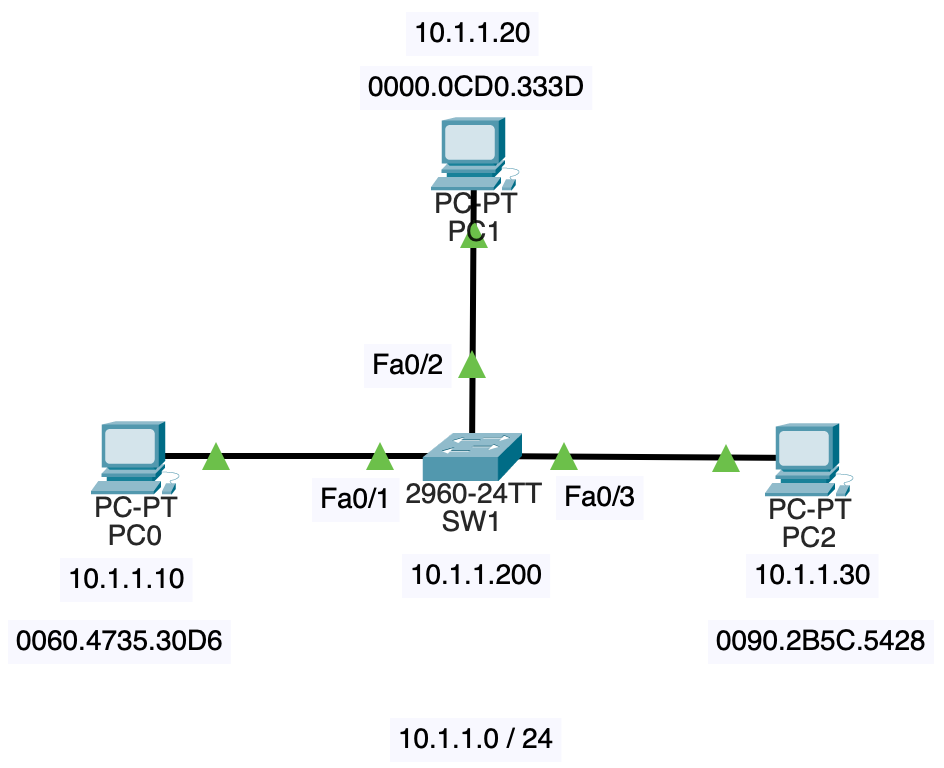
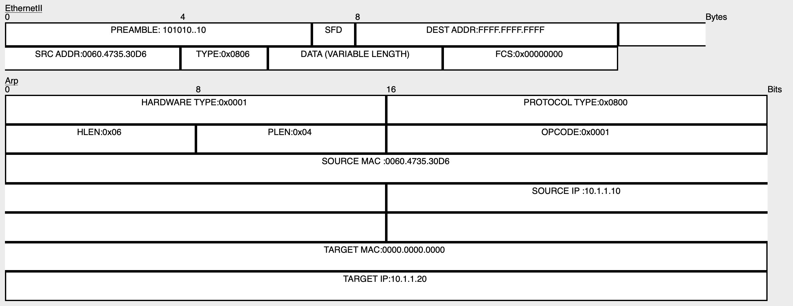
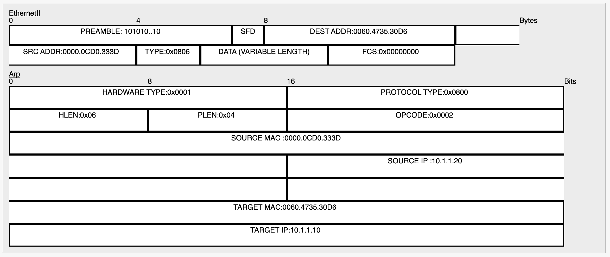

# NWの勉強
- ## ARP、MACアドレス学習
	- {:height 326, :width 514}
	- ストレートケーブルとクロスケーブル
		- インターフェース(ポート)にはMDIとMDI-Xの2種類がある
		- PCやルータはMDIで、スイッチはMDI-X
		- MDI同士、MDI-X同士を接続する時はクロスケーブル、MDIとMDI-Xを接続する時はストレートケーブルを用いる
		- Automatic(Auto) MDI/MDI-Xを備えた機器は、通信相手のインターフェースがMDIかMDI-Xかを判別して、自身のポートを変更することが出来るため、ケーブルの使い分けをしなくて済む
	- スイッチの設定
		- hostname、IPアドレス、サブネットマスクを設定する
		- ```
		  Switch>en
		  Switch#conf t
		  Switch(config)#hostname SW1
		  SW1(config)#int vlan1
		  SW1(config-if)#ip address 10.1.1.200 255.255.255.0
		  SW1(config-if)#no shut
		  ```
	- PC0からPC1に対してpingを飛ばす(`ping -n 1 10.1.1.20`)
		- 開始時、PC0のARPテーブルとスイッチのMACアドレステーブルは空とする
		- 
		- PC0はPC1のMACアドレスを知らないため、ARPリクエストを送信する(ARP: Address Resolution Protocol)
			- ARPリクエストはブロードキャストされる
			- ARPリクエストの構造は以下のようになっている([参考](https://zenn.dev/masahiro_toba/articles/273189798f9968))
				- {:height 261, :width 751}
				- L2ヘッダ
				  id:: 660ae19f-54fb-48da-96f2-7e632458cea0
					- プリアンブル
						- フレーム送信の合図となる信号で、8バイトのビット列
						- 先頭7バイトが1010101010、最後の1バイトが10101011になっている
						- 最後の1バイトをSFD(Start Frame Delimiter)と呼ぶ
					- 送信先MACアドレス
						- ブロードキャストなので、送信先MACアドレスがFFFF.FFFF.FFFFになっている
					- 送信元MACアドレス
					- タイプ
						- どんなプロトコルを使っているか表すID
						- IPv4 : 0x0800, ARP : 0x0806, IPv6 : 0x86DD
				- L2トレーラ
					- FCS(Frame Check Sequence)
						- フレームが壊れていないかチェックするための値
				- DATAと書いてある部分はARPのデータが入る
					- フォーマットについては[ここ](https://zenn.dev/masahiro_toba/articles/bef21eb54c4d8a)を参照
		- SW1はARPリクエストをPC1とPC2に転送する
			- MACアドレスが学習されていない時、スイッチは入力ポート以外の全てのポートにフレームを転送する
			- これをフラッディングと呼ぶ
			- ARPリクエストがSW1に到達したタイミングで、Fa0/1側に0060.4735.30D6が存在することがMACアドレステーブルに学習される
		- PC2は、ARPリクエスト中の送信先MACアドレスが自身のMACアドレスと一致しないため、ARPリクエストを無視する
		- PC1は、PC0に対してARP応答を送信する
			- {:height 340, :width 745}
			- ARP応答はユニキャストになる
				- L2ヘッダの送信先MACアドレスが0060.4735.30D6になっていることに注目
		- ARP応答がSW1に届く
			- このタイミングで、Fa0/2側に0000.0cd0.333dが存在することがMACアドレステーブルに学習される
		- SW1はPC0にARP応答を送信し、これによってPC0はPC1のMACアドレスを知ることが出来る
			- PC0のMACアドレスはMACアドレステーブルに学習されているので、フラッディングは発生しない
			- PC0はPC1のMACアドレスをARPテーブルに保存する
			- 実は、APRリクエストがPC1に届いた時点で、PC1もPC0のMACアドレスをARPテーブルに保存していた
		- ICMPのやりとりは省略
		- 終了後のMACアドレステーブル
			- ```
			  SW1#show mac-address-table 
			            Mac Address Table
			  -------------------------------------------
			  
			  Vlan    Mac Address       Type        Ports
			  ----    -----------       --------    -----
			  
			     1    0000.0cd0.333d    DYNAMIC     Fa0/2
			     1    0060.4735.30d6    DYNAMIC     Fa0/1
			  ```
			- clear mac-address-tableで削除出来る
		- 終了後のPC0のARPテーブル
			- ```
			  C:\>arp -a
			    Internet Address      Physical Address      Type
			    10.1.1.20             0000.0cd0.333d        dynamic
			  ```
			- arp -dで削除出来る
		- 終了後のPC1のARPテーブル
			- ```
			  C:\>arp -a
			    Internet Address      Physical Address      Type
			    10.1.1.10             0060.4735.30d6        dynamic
			  ```
	- RARP(Reverse Address Resolution Protocol)というMACアドレスからIPアドレスを取得するためのプロトコルもある
		- 組込機器でIPアドレスを保持しておくハードディスクがない場合に使われる
		- RARPサーバを用意しておき、RARPサーバにMACアドレスとIPアドレスの組を登録しておく
		- 自身のMACアドレスをRARPサーバに送信し(RARPリクエスト)、RARPサーバからIPアドレスを受け取る(RARP応答)
		- DHCPに取って代わられ、現在はあまり使われていない([参考](https://e-words.jp/w/RARP.html))