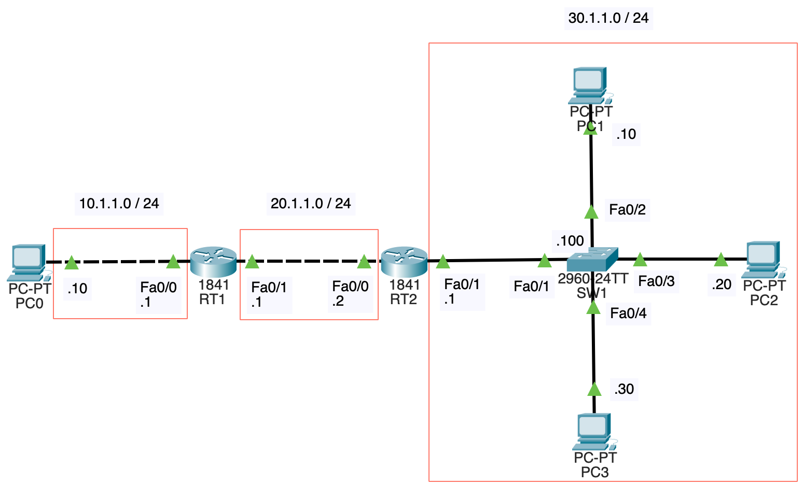
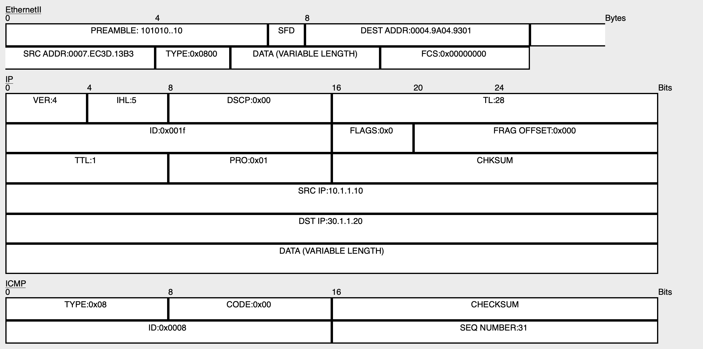
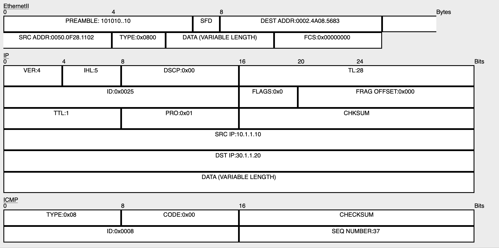
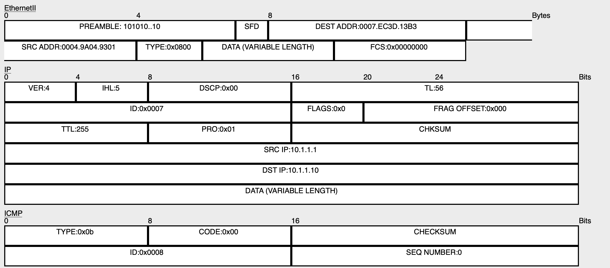
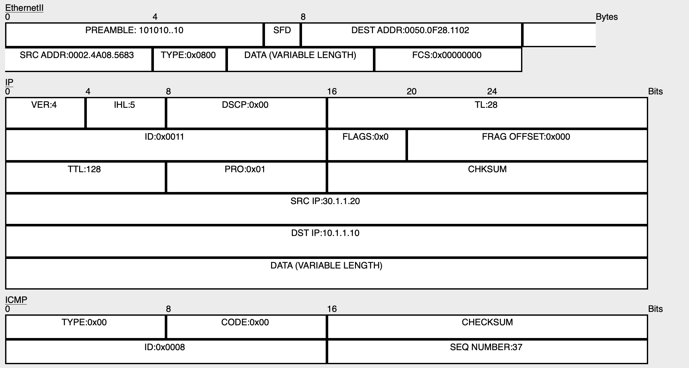

# NWの勉強
- ## tracert / traceroute
	- {:height 406, :width 723}
	- PCの設定
		- IPアドレス、サブネットマスク、デフォルトゲートウェイを設定する
		- 例えば、PC0のIPアドレスは10.1.1.0、サブネットマスクは255.255.255.0、デフォルトゲートウェイは10.1.1.1
	- スイッチの設定
		- hostname、IPアドレス、サブネットマスクを設定する
			- ```
			  Switch>en
			  Switch#conf t
			  Switch(config)#hostname SW1
			  SW1(config)#int vlan1
			  SW1(config-if)#ip address 30.1.1.100 255.255.255.0
			  SW1(config-if)#no shut
			  ```
	- ルータの設定
		- hostname、各インターフェースのIPアドレス、サブネットマスクを設定する
			- ```
			  Router>en
			  Router#conf t
			  Router(config)#hostname RT1
			  RT1(config)#int fa0/0
			  RT1(config-if)#ip address 10.1.1.1 255.255.255.0
			  RT1(config-if)#no shut
			  RT1(config)#int fa0/1
			  RT1(config-if)#ip address 20.1.1.1 255.255.255.0
			  RT1(config-if)#no shut
			  ```
			- RT2も同様に設定する
		- スタティックルーティングの設定
			- RT1
				- ```
				  RT1>en
				  RT1#conf t
				  RT1(config)#ip route 30.1.1.0 255.255.255.0 20.1.1.2
				  RT1(config)#exit
				  RT1#show ip route
				  Codes: C - connected, S - static, I - IGRP, R - RIP, M - mobile, B - BGP
				         D - EIGRP, EX - EIGRP external, O - OSPF, IA - OSPF inter area
				         N1 - OSPF NSSA external type 1, N2 - OSPF NSSA external type 2
				         E1 - OSPF external type 1, E2 - OSPF external type 2, E - EGP
				         i - IS-IS, L1 - IS-IS level-1, L2 - IS-IS level-2, ia - IS-IS inter area
				         * - candidate default, U - per-user static route, o - ODR
				         P - periodic downloaded static route
				  
				  Gateway of last resort is not set
				  
				       10.0.0.0/24 is subnetted, 1 subnets
				  C       10.1.1.0 is directly connected, FastEthernet0/0
				       20.0.0.0/24 is subnetted, 1 subnets
				  C       20.1.1.0 is directly connected, FastEthernet0/1
				       30.0.0.0/24 is subnetted, 1 subnets
				  S       30.1.1.0 [1/0] via 20.1.1.2
				  ```
			- RT2
				- ```
				  RT2>en
				  RT2#conf t
				  Enter configuration commands, one per line.  End with CNTL/Z.
				  RT2(config)#ip route 10.1.1.0 255.255.255.0 20.1.1.1
				  RT2(config)#exit
				  RT2#show ip route
				  Codes: C - connected, S - static, I - IGRP, R - RIP, M - mobile, B - BGP
				         D - EIGRP, EX - EIGRP external, O - OSPF, IA - OSPF inter area
				         N1 - OSPF NSSA external type 1, N2 - OSPF NSSA external type 2
				         E1 - OSPF external type 1, E2 - OSPF external type 2, E - EGP
				         i - IS-IS, L1 - IS-IS level-1, L2 - IS-IS level-2, ia - IS-IS inter area
				         * - candidate default, U - per-user static route, o - ODR
				         P - periodic downloaded static route
				  
				  Gateway of last resort is not set
				  
				       10.0.0.0/24 is subnetted, 1 subnets
				  S       10.1.1.0 [1/0] via 20.1.1.1
				       20.0.0.0/24 is subnetted, 1 subnets
				  C       20.1.1.0 is directly connected, FastEthernet0/0
				       30.0.0.0/24 is subnetted, 1 subnets
				  C       30.1.1.0 is directly connected, FastEthernet0/1
				  ```
	- 事前にPC0からPC2にpingを飛ばしておいて、PC/ルータのARPテーブル、スイッチのMACアドレステーブルを作成する
		- PC0のARPテーブル
			- ```
			  ```
			- RT1のFa0/0(=PC0のデフォルトゲートウェイ)のMACアドレスが記録されている
		- RT1のARPテーブル
			- ```
			  RT1#show arp
			  Protocol  Address          Age (min)  Hardware Addr   Type   Interface
			  Internet  10.1.1.1                -   0004.9A04.9301  ARPA   FastEthernet0/0
			  Internet  10.1.1.10               10  0007.EC3D.13B3  ARPA   FastEthernet0/0
			  Internet  20.1.1.1                -   0004.9A04.9302  ARPA   FastEthernet0/1
			  Internet  20.1.1.2                10  0050.0F28.1101  ARPA   FastEthernet0/1
			  ```
			- 自身のMACアドレスに加え、PC0のMACアドレスとRT2のFa0/0のMACアドレスが記録されている
		- RT2のARPテーブル
			- ```
			  RT2#show arp
			  Protocol  Address          Age (min)  Hardware Addr   Type   Interface
			  Internet  20.1.1.1                14  0004.9A04.9302  ARPA   FastEthernet0/0
			  Internet  20.1.1.2                -   0050.0F28.1101  ARPA   FastEthernet0/0
			  Internet  30.1.1.1                -   0050.0F28.1102  ARPA   FastEthernet0/1
			  Internet  30.1.1.20               14  0002.4A08.5683  ARPA   FastEthernet0/1
			  ```
			- 自身のMACアドレスに加え、RT1のFa0/1のMACアドレスとPC2のMACアドレスが記録されている
		- PC2のARPテーブル
			- ```
			  C:\>arp -a
			    Internet Address      Physical Address      Type
			    30.1.1.1              0050.0f28.1102        dynamic
			  ```
			- RT2のFa0/1(=PC2のデフォルトゲートウェイ)のMACアドレスが記録されている
		- SW1のMACアドレステーブル
			- ```
			  SW1>show mac-address-table 
			            Mac Address Table
			  -------------------------------------------
			  
			  Vlan    Mac Address       Type        Ports
			  ----    -----------       --------    -----
			  
			     1    0002.4a08.5683    DYNAMIC     Fa0/3
			     1    0050.0f28.1102    DYNAMIC     Fa0/1
			  ```
			- PC2のMACアドレスとRT2のFa0/1のMACアドレスが記録されている
	- PC0からPC2にtracertを飛ばす(`tracert 30.1.1.20` UNIXではtraceroute)
		- 
		- ```
		  ```
		- PC0はまずTTLが1のICMPパケットを送信する
			- PC0からRT1へのICMPパケット
				- {:height 351, :width 686}
				- L2ヘッダ
					- 送信元MACアドレスがPC0のMACアドレス、送信先MACアドレスがRT1のFa0/0のMACアドレスになっている
						- タイプはIPv4を表す0x0800になっている
				- IPヘッダ([参考](https://www.infraexpert.com/study/tcpip1.html))
					- バージョン : IPv4なら4、IPv6なら6
					- TTL : ルータやL3SWを通過するたびにTTLが1減る
					- プロトコル
						- 今回はICMPなので1になっている
						- 他には、6(TCP), 17(UDP), 41(IPv6), 50(ESP), 51(AH)など
					- 送信元IPアドレス
					- 送信先IPアドレス
			- PC0からPC2へのパケットにおいて、送信元MACアドレス、送信先MACアドレスは変化していくが、送信元IPアドレス、送信先IPアドレスは変化しない
				- 例えば、RT2からPC2へのICMPパケットは以下のようになっている
					- {:height 373, :width 763}
					- 送信元IPアドレスと送信先IPアドレスはPC0からRT1へのICMPパケットと変わらないが、送信元MACアドレスはRT2のFa0/1のMACアドレス、送信先MACアドレスはPC2のMACアドレスに変化している
			- DATAと書いてある部分はICMPのデータが入る
				- フォーマットについては[ここ](https://www.infraexpert.com/study/tcpip4.html)を参照
				- タイプは、0(エコー応答)、8(エコー要求)、11(時間超過)など
			- TTLが1のICMPパケットを受け取ったRT1はTTLを1減らし、TTLが0になったので、ICMP時間超過メッセージを返す
				- {:height 409, :width 776}
				- ICMPのタイプが11(時間超過)になっている
				- TTLは255になっている
					- TTLの初期値は機器によって変わる([参考](https://qiita.com/ine1127/items/dae039f662656c10e7d1))
					- pingで返ってきたTTLの値とtracerouteで分かる経由するルータの数から、機器を推定することも出来るらしい([参考](https://zenn.dev/tetsuyaohira/articles/868fbdb9fc1e33))
		- TTLが1のICMPパケットを3回送る → TTLが2のICMPパケットを3回送る → TTLが3のパケットを3回送る という動作になっている
		- TTLが3のICMPパケットは、TTLが1になってPC2まで到達する
			- PC2はICMPエコー応答を返す
				- {:height 435, :width 807}
				- ICMPのタイプが0(エコー応答)になっている
				- TTLは128になっている