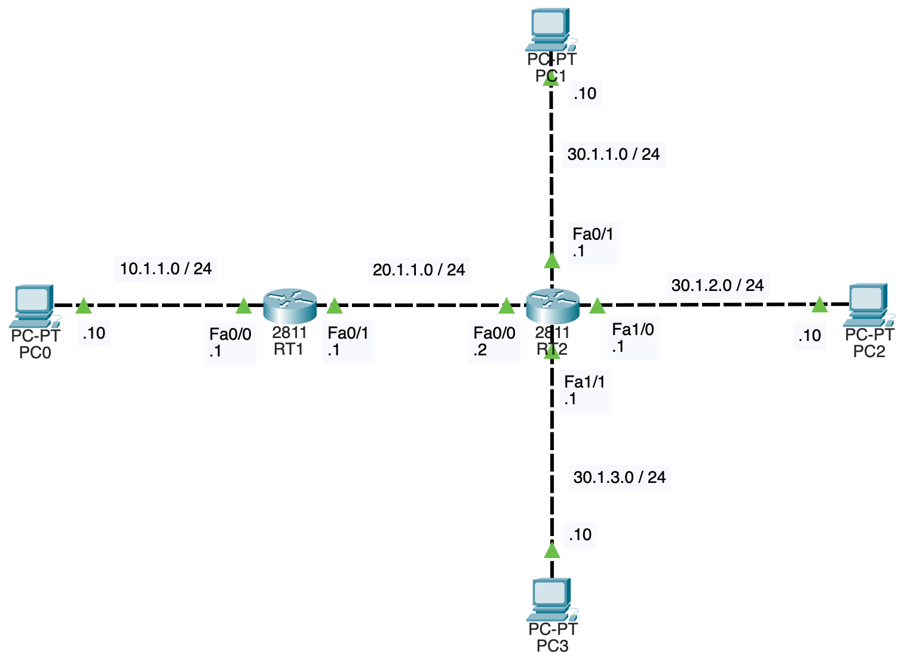

# NWの勉強
- ## 経路集約、ルーティングループ、ロンゲストマッチ
	- [参考](https://xtech.nikkei.com/it/article/COLUMN/20080715/310883/)
	- 令和3年 午後1 問2の状況を再現
	- {:height 556, :width 738}
	- ルータは1841ではなく、2811を使っている
	- RT2は[ここ](https://hetare-nw.net/archives/206)の手順に従い、ポートの数を4個に増やしている
	- 以下のようにスタティックルーティングを設定すれば通信出来る
		- RT1
			- ```
			  RT1(config)#ip route 30.1.1.0 255.255.255.0 20.1.1.2
			  RT1(config)#ip route 30.1.2.0 255.255.255.0 20.1.1.2
			  RT1(config)#ip route 30.1.3.0 255.255.255.0 20.1.1.2
			  RT1(config)#exit
			  RT1#show ip route
			  Codes: L - local, C - connected, S - static, R - RIP, M - mobile, B - BGP
			         D - EIGRP, EX - EIGRP external, O - OSPF, IA - OSPF inter area
			         N1 - OSPF NSSA external type 1, N2 - OSPF NSSA external type 2
			         E1 - OSPF external type 1, E2 - OSPF external type 2, E - EGP
			         i - IS-IS, L1 - IS-IS level-1, L2 - IS-IS level-2, ia - IS-IS inter area
			         * - candidate default, U - per-user static route, o - ODR
			         P - periodic downloaded static route
			  
			  Gateway of last resort is not set
			  
			       10.0.0.0/8 is variably subnetted, 2 subnets, 2 masks
			  C       10.1.1.0/24 is directly connected, FastEthernet0/0
			  L       10.1.1.1/32 is directly connected, FastEthernet0/0
			       20.0.0.0/8 is variably subnetted, 2 subnets, 2 masks
			  C       20.1.1.0/24 is directly connected, FastEthernet0/1
			  L       20.1.1.1/32 is directly connected, FastEthernet0/1
			       30.0.0.0/24 is subnetted, 3 subnets
			  S       30.1.1.0/24 [1/0] via 20.1.1.2
			  S       30.1.2.0/24 [1/0] via 20.1.1.2
			  S       30.1.3.0/24 [1/0] via 20.1.1.2
			  ```
		- RT2
			- ```
			  RT2(config)#ip route 10.1.1.0 255.255.255.0 20.1.1.1
			  RT2(config)#exit
			  RT2#show ip route
			  Codes: L - local, C - connected, S - static, R - RIP, M - mobile, B - BGP
			         D - EIGRP, EX - EIGRP external, O - OSPF, IA - OSPF inter area
			         N1 - OSPF NSSA external type 1, N2 - OSPF NSSA external type 2
			         E1 - OSPF external type 1, E2 - OSPF external type 2, E - EGP
			         i - IS-IS, L1 - IS-IS level-1, L2 - IS-IS level-2, ia - IS-IS inter area
			         * - candidate default, U - per-user static route, o - ODR
			         P - periodic downloaded static route
			  
			  Gateway of last resort is not set
			  
			       10.0.0.0/24 is subnetted, 1 subnets
			  S       10.1.1.0/24 [1/0] via 20.1.1.1
			       20.0.0.0/8 is variably subnetted, 2 subnets, 2 masks
			  C       20.1.1.0/24 is directly connected, FastEthernet0/0
			  L       20.1.1.2/32 is directly connected, FastEthernet0/0
			       30.0.0.0/8 is variably subnetted, 6 subnets, 2 masks
			  C       30.1.1.0/24 is directly connected, FastEthernet0/1
			  L       30.1.1.1/32 is directly connected, FastEthernet0/1
			  C       30.1.2.0/24 is directly connected, FastEthernet1/0
			  L       30.1.2.1/32 is directly connected, FastEthernet1/0
			  C       30.1.3.0/24 is directly connected, FastEthernet1/1
			  L       30.1.3.1/32 is directly connected, FastEthernet1/1
			  ```
	- 30.1.1.0/24, 30.1.2.0/24, 30.1.3.0/24を経路集約して、RT1のルーティングテーブルのサイズを小さくする
		- 上位22ビットまで共通しているので、30.1.0.0/22を登録すれば良い
		- RT1
			- ```
			  RT1(config)#no ip route 30.1.1.0 255.255.255.0
			  RT1(config)#no ip route 30.1.2.0 255.255.255.0
			  RT1(config)#no ip route 30.1.3.0 255.255.255.0
			  RT1(config)#ip route 30.1.0.0 255.255.252.0 20.1.1.2
			  RT1(config)#exit
			  RT1#show ip route
			  Codes: L - local, C - connected, S - static, R - RIP, M - mobile, B - BGP
			         D - EIGRP, EX - EIGRP external, O - OSPF, IA - OSPF inter area
			         N1 - OSPF NSSA external type 1, N2 - OSPF NSSA external type 2
			         E1 - OSPF external type 1, E2 - OSPF external type 2, E - EGP
			         i - IS-IS, L1 - IS-IS level-1, L2 - IS-IS level-2, ia - IS-IS inter area
			         * - candidate default, U - per-user static route, o - ODR
			         P - periodic downloaded static route
			  
			  Gateway of last resort is not set
			  
			       10.0.0.0/8 is variably subnetted, 2 subnets, 2 masks
			  C       10.1.1.0/24 is directly connected, FastEthernet0/0
			  L       10.1.1.1/32 is directly connected, FastEthernet0/0
			       20.0.0.0/8 is variably subnetted, 2 subnets, 2 masks
			  C       20.1.1.0/24 is directly connected, FastEthernet0/1
			  L       20.1.1.1/32 is directly connected, FastEthernet0/1
			       30.0.0.0/22 is subnetted, 1 subnets
			  S       30.1.0.0/22 [1/0] via 20.1.1.2
			  ```
	- 経路集約を行うと、ルーティングループが発生することがある
		- PC0で`ping 30.1.0.10`を実行する
		- 30.1.0.10は30.1.0.0/22の中に含まれるので、ICMPパケットはRT2まで到達するが、RT2のルーティングテーブル内に対応するネクストホップが存在しないため、RT2からタイプ3(到達不能)のICMPパケットが返ってくる
			- 
		- 次にRT2のデフォルトルートをRT1に設定する
			- ```
			  RT2(config)#ip route 0.0.0.0 0.0.0.0 20.1.1.1
			  RT2(config)#exit
			  RT2#show ip route
			  Codes: L - local, C - connected, S - static, R - RIP, M - mobile, B - BGP
			         D - EIGRP, EX - EIGRP external, O - OSPF, IA - OSPF inter area
			         N1 - OSPF NSSA external type 1, N2 - OSPF NSSA external type 2
			         E1 - OSPF external type 1, E2 - OSPF external type 2, E - EGP
			         i - IS-IS, L1 - IS-IS level-1, L2 - IS-IS level-2, ia - IS-IS inter area
			         * - candidate default, U - per-user static route, o - ODR
			         P - periodic downloaded static route
			  
			  Gateway of last resort is 20.1.1.1 to network 0.0.0.0
			  
			       10.0.0.0/24 is subnetted, 1 subnets
			  S       10.1.1.0/24 [1/0] via 20.1.1.1
			       20.0.0.0/8 is variably subnetted, 2 subnets, 2 masks
			  C       20.1.1.0/24 is directly connected, FastEthernet0/0
			  L       20.1.1.2/32 is directly connected, FastEthernet0/0
			       30.0.0.0/8 is variably subnetted, 6 subnets, 2 masks
			  C       30.1.1.0/24 is directly connected, FastEthernet0/1
			  L       30.1.1.1/32 is directly connected, FastEthernet0/1
			  C       30.1.2.0/24 is directly connected, FastEthernet1/0
			  L       30.1.2.1/32 is directly connected, FastEthernet1/0
			  C       30.1.3.0/24 is directly connected, FastEthernet1/1
			  L       30.1.3.1/32 is directly connected, FastEthernet1/1
			  S*   0.0.0.0/0 [1/0] via 20.1.1.1
			  ```
		- 再度PC0で`ping 30.1.0.10`を実行する
			- 今度はRT1とRT2でルーティングループが発生する
			- 
	- このルーティングループを防ぐために、RT2に以下のルーティングを追加する
		- ```
		  RT2(config)#ip route 30.1.0.0 255.255.252.0 Null0
		  RT2(config)#exit
		  RT2#show ip route
		  Codes: L - local, C - connected, S - static, R - RIP, M - mobile, B - BGP
		         D - EIGRP, EX - EIGRP external, O - OSPF, IA - OSPF inter area
		         N1 - OSPF NSSA external type 1, N2 - OSPF NSSA external type 2
		         E1 - OSPF external type 1, E2 - OSPF external type 2, E - EGP
		         i - IS-IS, L1 - IS-IS level-1, L2 - IS-IS level-2, ia - IS-IS inter area
		         * - candidate default, U - per-user static route, o - ODR
		         P - periodic downloaded static route
		  
		  Gateway of last resort is 20.1.1.1 to network 0.0.0.0
		  
		       10.0.0.0/24 is subnetted, 1 subnets
		  S       10.1.1.0/24 [1/0] via 20.1.1.1
		       20.0.0.0/8 is variably subnetted, 2 subnets, 2 masks
		  C       20.1.1.0/24 is directly connected, FastEthernet0/0
		  L       20.1.1.2/32 is directly connected, FastEthernet0/0
		       30.0.0.0/8 is variably subnetted, 7 subnets, 3 masks
		  S       30.1.0.0/22 is directly connected, Null0
		  C       30.1.1.0/24 is directly connected, FastEthernet0/1
		  L       30.1.1.1/32 is directly connected, FastEthernet0/1
		  C       30.1.2.0/24 is directly connected, FastEthernet1/0
		  L       30.1.2.1/32 is directly connected, FastEthernet1/0
		  C       30.1.3.0/24 is directly connected, FastEthernet1/1
		  L       30.1.3.1/32 is directly connected, FastEthernet1/1
		  S*   0.0.0.0/0 [1/0] via 20.1.1.1
		  ```
		- `ip route 30.1.0.0 255.255.252.0 Null0`は30.1.0.0/22宛ての通信を捨てることを意味する
		- これにより、RT2は30.1.0.10宛ての通信を捨てるようになり、ルーティングループは発生しない
			- 代わりにRT2からタイプ3(到達不能)のICMPパケットが返ってくるようになる
		- 30.1.1.10, 30.1.2.10, 30.1.3.10宛ての通信も捨てられてしまうのかというと、そうではない
			- 送信先IPアドレスに対応するネクストホップが複数存在する時に、ネットワークアドレス長が最も長いものを使用するという決まりがあるためである
			- この決まりをロンゲストマッチという