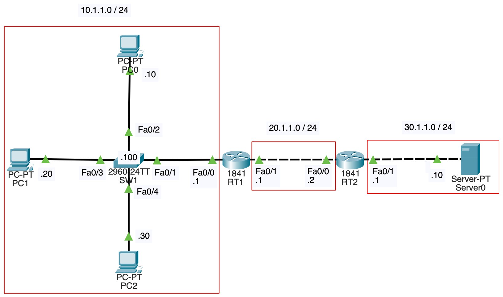
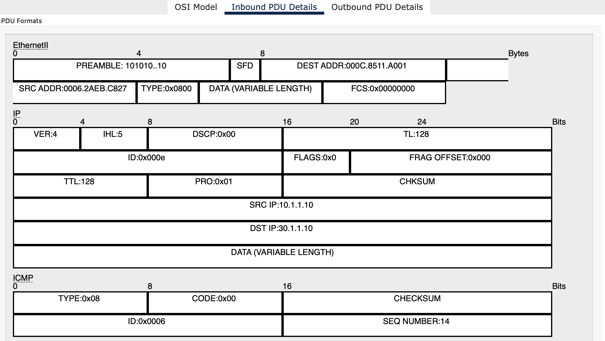
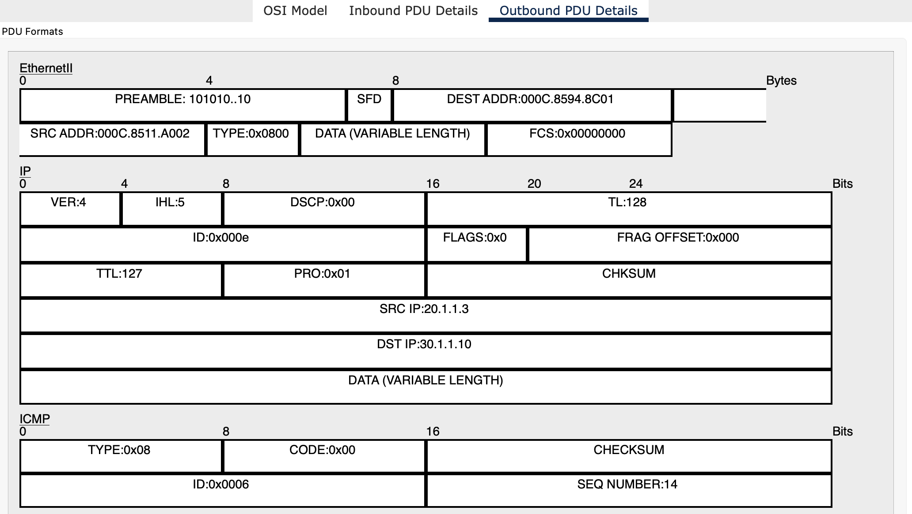
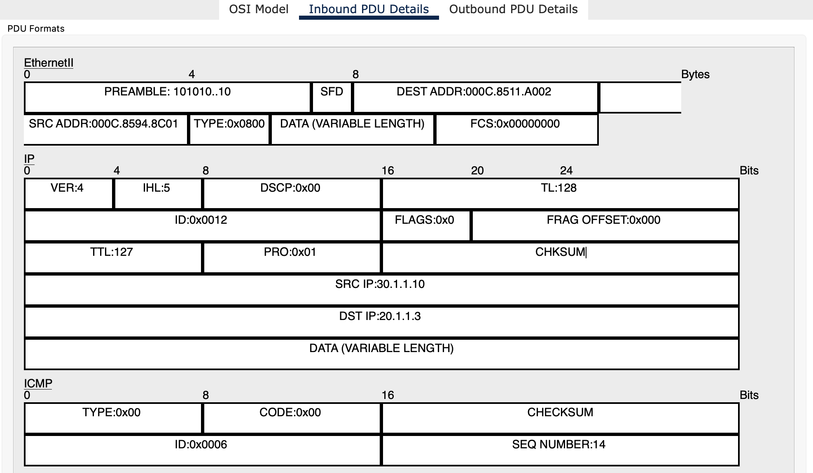
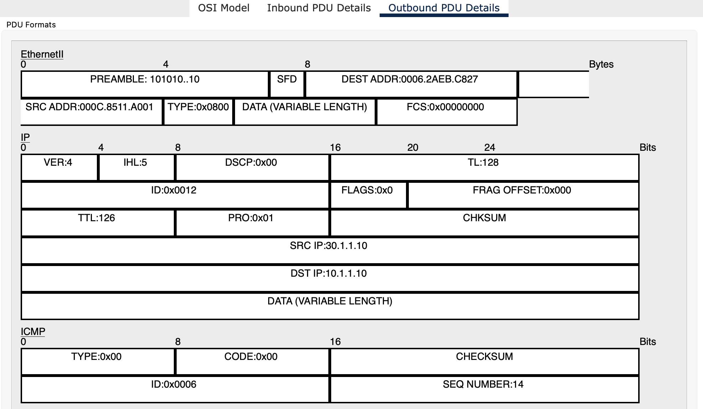

# NWの勉強
- ## NAT
- {:height 404, :width 669}
	- RT1でNATを行う
	- RT1で`ip route 30.1.1.0 255.255.255.0 20.1.1.2`をしておく
- ### スタティックNAT
	- 1対1の変換規則
	- RT1
		- ```
		  RT1(config)#int fa0/0
		  RT1(config-if)#ip nat inside 
		  RT1(config-if)#int fa0/1
		  RT1(config-if)#ip nat outside
		  RT1(config-if)#exit
		  RT1(config)#ip nat inside source static 10.1.1.10 20.1.1.3
		  RT1(config)#ip nat inside source static 10.1.1.20 20.1.1.4
		  RT1(config)#ip nat inside source static 10.1.1.30 20.1.1.5
		  RT1(config)#exit
		  RT1#show ip nat translations
		  Pro  Inside global     Inside local       Outside local      Outside global
		  ---  20.1.1.3          10.1.1.10          ---                ---
		  ---  20.1.1.4          10.1.1.20          ---                ---
		  ---  20.1.1.5          10.1.1.30          ---                ---
		  ```
		- NATの内側を`ip nat inside`で、NATの外側を`ip nat outside`で設定する
		- `show ip nat translations`でNATテーブルを確認出来る([参考](https://www.infraexpert.com/study/ip10.html))
			- Inside local(内部ローカルアドレス) : 内部ネットワークのホストに割り当てられるIPアドレス
			- Inside global(内部グローバルアドレス) : 外部ネットワークから見た内部ネットワークのホストのIPアドレス
			- Outside localは外部ローカルアドレス、Outside globalは外部グローバルアドレスであるが、この2つの違いは不明
	- PC0からServer0にpingを飛ばす(`ping 30.1.1.10`)
		- RT1を通過するICMPエコー要求(タイプ8)を見る
			- Inbound
				- {:height 313, :width 606}
			- Outbound
				- {:height 434, :width 607}
			- 送信元MACアドレス、送信先MACアドレスが変わっていたり、TTLが1減っていたりするが、注目すべきは送信元IPアドレスが10.1.1.10から20.1.1.3に変わっている点である
		- RT1を通過するICMPエコー応答(タイプ0)を見る
			- Inbound
				- {:height 360, :width 607}
			- Outbound
				- {:height 469, :width 608}
			- 送信先IPアドレスが20.1.1.3から30.1.1.10に変わっている
		- 送信先IPアドレスが20.1.1.3のICMPパケットを受け取ったRT2は、20.1.1.3のMACアドレスがARPテーブルに記録されていない場合、ARPリクエストを送信し、RT1がARP応答を返す
			- 結果的にRT2のARPテーブルは以下のようになる
				- ```
				  RT2#show arp
				  Protocol  Address          Age (min)  Hardware Addr   Type   Interface
				  Internet  20.1.1.1                0   000C.8511.A002  ARPA   FastEthernet0/0
				  Internet  20.1.1.2                -   000C.8594.8C01  ARPA   FastEthernet0/0
				  Internet  20.1.1.3                0   000C.8511.A002  ARPA   FastEthernet0/0
				  Internet  30.1.1.1                -   000C.8594.8C02  ARPA   FastEthernet0/1
				  Internet  30.1.1.10               0   0060.2F10.1CC9  ARPA   FastEthernet0/1
				  ```
				- 20.1.1.3とRT1のFa0/1のMACアドレスが対応している
- ### ダイナミックNAT
	- 内部グローバルアドレスを予めNATプールに登録しておいて、都度割り当てる
	- RT1
		- ```
		  RT1(config)#int fa0/0
		  RT1(config-if)#ip nat inside 
		  RT1(config-if)#int fa0/1
		  RT1(config-if)#ip nat outside
		  RT1(config-if)#exit
		  RT1(config)#ip nat pool dnat 20.1.1.3 20.1.1.5 netmask 255.255.255.0
		  RT1(config)#access-list 1 permit 10.1.1.0 0.0.0.255
		  RT1(config)#ip nat inside source list 1 pool dnat
		  ```
		- `ip nat pool dnat 20.1.1.3 20.1.1.5 netmask 255.255.255.0`
			- dnatの部分はNATプールの名前(何でも良い)
			- 20.1.1.3はNATプールの開始アドレス、20.1.1.5はNATプールの終了アドレス
		- `access-list 1 permit 10.1.1.0 0.0.0.255`
			- 変換対象となる内部ローカルアドレスはACLで指定する
			- 0.0.0.255というのはワイルドカードマスクである
				- 0の箇所は基準となるIPアドレスのbitのまま、1の箇所は0でも1でも良い
			- サブネットマスクではなく、ワイルドカードマスクを使用した方が柔軟性が高いかららしい([参考](https://milestone-of-se.nesuke.com/nw-basic/acl/wildcard/))
				- 192.168.0.0/16を/24に分割し、各セグメント内の第4オクテットが1~15のPCを指定する時、ワイルドカードマスクで0.0.255.15とすれば良い
	- 初めはNATテーブルは空であるが、PC0からServer0にpingを送信すると、以下のようになる
		- ```
		  RT1#show ip nat translations
		  Pro  Inside global     Inside local       Outside local      Outside global
		  icmp 20.1.1.3:50       10.1.1.10:50       30.1.1.10:50       30.1.1.10:50
		  icmp 20.1.1.3:51       10.1.1.10:51       30.1.1.10:51       30.1.1.10:51
		  icmp 20.1.1.3:52       10.1.1.10:52       30.1.1.10:52       30.1.1.10:52
		  icmp 20.1.1.3:53       10.1.1.10:53       30.1.1.10:53       30.1.1.10:53
		  ```
		- なぜかNAPTみたいな表示になっている(50, 51, 52, 53が何なのかは後述)
	- NATプールのアドレスの数だけ内部ネットワークから同時接続可能
		- 内部グローバルアドレスを1個だけにしたとする(`ip nat pool dnat 20.1.1.3 20.1.1.3 netmask 255.255.255.0`)
		- この場合、NATテーブルに10.1.1.10(PC0)の変換が残っている限りは、10.1.1.20(PC1), 10.1.1.30(PC2)はServer0に接続出来なくなる
- ### NAPT
	- 1つの内部グローバルアドレスを複数の内部ローカルアドレスで共有する
	- TCP/UDPヘッダ内のポート番号を紐付けてNATテーブルに記録する
	- RT1
		- ```
		  RT1(config)#int fa0/0
		  RT1(config-if)#ip nat inside 
		  RT1(config-if)#int fa0/1
		  RT1(config-if)#ip nat outside
		  RT1(config-if)#exit
		  RT1(config)#ip nat pool napt 20.1.1.3 20.1.1.3 netmask 255.255.255.0
		  RT1(config)#access-list 1 permit 10.1.1.0 0.0.0.255
		  RT1(config)#ip nat inside source list 1 pool napt overload
		  ```
		- ダイナミックNATの時の最後のコマンドにoverloadをつけるとNAPTになる
	- PC0, PC1, PC2からWeb BrowserでServer0にアクセスすると、NATテーブルは以下のようになった
		- ```
		  RT1(config)#do show ip nat translations
		  Pro  Inside global     Inside local       Outside local      Outside global
		  tcp 20.1.1.3:1025      10.1.1.30:1025     30.1.1.10:80       30.1.1.10:80
		  tcp 20.1.1.3:1033      10.1.1.10:1033     30.1.1.10:80       30.1.1.10:80
		  tcp 20.1.1.3:1037      10.1.1.20:1037     30.1.1.10:80       30.1.1.10:80
		  ```
		- 1025, 1033, 1037はTCPヘッダの送信元ポート番号になっていた
	- TCP/UDPヘッダ内のポート番号が使われるといっても、ネットワーク層で動作するICMPの場合はどうなる？という疑問が生じる
		- PC0, PC1, PC2からServer0にpingを飛ばすとNATテーブルは以下のようになる
			- ```
			  RT1(config)#do show ip nat translations
			  Pro  Inside global     Inside local       Outside local      Outside global
			  icmp 20.1.1.3:1        10.1.1.30:1        30.1.1.10:1        30.1.1.10:1
			  icmp 20.1.1.3:2        10.1.1.30:2        30.1.1.10:2        30.1.1.10:2
			  icmp 20.1.1.3:30       10.1.1.20:30       30.1.1.10:30       30.1.1.10:30
			  icmp 20.1.1.3:31       10.1.1.20:31       30.1.1.10:31       30.1.1.10:31
			  icmp 20.1.1.3:32       10.1.1.20:32       30.1.1.10:32       30.1.1.10:32
			  icmp 20.1.1.3:33       10.1.1.20:33       30.1.1.10:33       30.1.1.10:33
			  icmp 20.1.1.3:3        10.1.1.30:3        30.1.1.10:3        30.1.1.10:3
			  icmp 20.1.1.3:4        10.1.1.30:4        30.1.1.10:4        30.1.1.10:4
			  icmp 20.1.1.3:58       10.1.1.10:58       30.1.1.10:58       30.1.1.10:58
			  icmp 20.1.1.3:59       10.1.1.10:59       30.1.1.10:59       30.1.1.10:59
			  icmp 20.1.1.3:60       10.1.1.10:60       30.1.1.10:60       30.1.1.10:60
			  icmp 20.1.1.3:61       10.1.1.10:61       30.1.1.10:61       30.1.1.10:61
			  ```
			- ポート番号の代わりとして使われているのは、ICMPパケット内のSEQ NUMBERだった([検証記事](https://izuminmin.com/network/icmpping-napt/))
	- NATテーブルを見ると、変換前のポート番号がそのまま変換後のポート番号になるように見えるが、例えば、PC0とPC1が両方ともポート番号3000で通信を始めたら、PC0の変換後ポートは3000、PC1の変換後ポートは3001になったりする([参考](https://okwave.jp/qa/q8295302.html))
- ### NATトラバーサル(NAT超え)
	- [参考](https://e-words.jp/w/NAT%E3%83%88%E3%83%A9%E3%83%90%E3%83%BC%E3%82%B5%E3%83%AB.html)
	- RT2で`ip route 10.1.1.0 255.255.255.0 20.1.1.1`をすれば、Server0から10.1.1.10, 10.1.1.20, 10.1.1.30を指定してpingを飛ばすことが出来る
		- ```
		  C:\>ping 10.1.1.10
		  
		  Pinging 10.1.1.10 with 32 bytes of data:
		  
		  Reply from 20.1.1.3: bytes=32 time=40ms TTL=126
		  Reply from 20.1.1.3: bytes=32 time<1ms TTL=126
		  Reply from 20.1.1.3: bytes=32 time<1ms TTL=126
		  Reply from 20.1.1.3: bytes=32 time=10ms TTL=126
		  
		  Ping statistics for 10.1.1.10:
		      Packets: Sent = 4, Received = 4, Lost = 0 (0% loss),
		  Approximate round trip times in milli-seconds:
		      Minimum = 0ms, Maximum = 40ms, Average = 12ms
		  ```
		- Reply from 10.1.1.10ではなく、Reply from 20.1.1.3となっているところに注目
	- しかし通常は、NATの外側の端末はNATの内側のIPアドレスを知ることは出来ない
	- これによって、P2P通信が正常に動作しないという問題が発生し、これを回避することをNATトラバーサルという
		- 使用される技術は不明
	- また、IPSecを使うと、TCP/UDPヘッダが暗号化されることからNAPTが動かなくなるという問題があり、これを回避することもNATトラバーサルというらしい([参考](https://www.infraexpert.com/study/ipsec15.html))
		- ルータにIPSecパススルー機能というのを搭載することで回避出来るとのこと