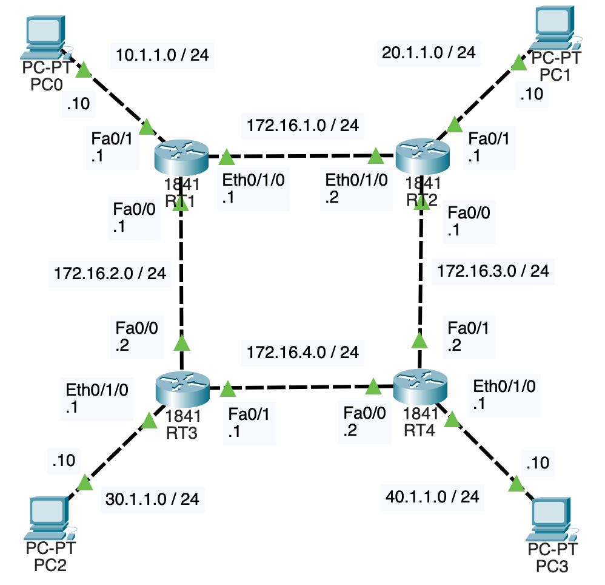

# NWの勉強
- ## RIP
	- {:height 566, :width 382}
	- 各ルータにWIC-1ENETを使用し、イーサネットのポートを1つ増やしている
	- 各ルータにRIPの設定を行う
		- RT1
			- ```
			  RT1(config)#router rip
			  RT1(config-router)#version 2
			  RT1(config-router)#network 10.0.0.0
			  RT1(config-router)#network 172.16.0.0
			  ```
			- `version 2`
				- RIPをバージョン2として動作させる
				- バージョン1ではクラスフルアドレッシング対応だが、バージョン2ではクラスレスアドレッシング対応
				- [バージョン1で発生しうる問題](http://www.ccna-navi.com/archives/205)
			- `network 10.0.0.0`, `network 172.16.0.0`
				- 属するネットワークを指定する
				- クラスフルアドレッシングで指定する必要がある
					- 10.1.1.0/24であれば、10.1.1.0がクラスAでネットワーク部が8ビットなので、10.0.0.0になる
					- 172.16.1.0/24であれば、172.16.1.0がクラスBでネットワーク部が16ビットなので、172.16.0.0になる
		- RT2, RT3, RT4も同様に設定する
	- RIPでは、30秒に1回、自身が持つ経路情報を隣接ルータに送信する
		- 例えば、初めRT1は10.1.1.0/24に属する(=距離0)という情報を持っている
			- 情報の形式は(ネットワーク、距離)として、(10.1.1.0/24, 0)と考える
			- 他にも、(172.16.1.0/24, 0), (172.16.2.0/24, 0)という情報を持っている
		- RT1は(10.1.1.0/24, 0)の距離に1を加算して(10.1.1.0/24, 1)をRT2とRT3に送信する
		- これをRT1から受け取ったRT2は、10.1.1.0/24までの距離は1で、10.1.1.0/24宛の通信は、172.16.1.1に送信すれば良いということを学習する
		- RT2は距離に1を加算して(10.1.1.0/24, 2)をRT4に送信する
			- ここで重要なのがRT1には送信しないということである(スプリットホライズンという)
			- 元となる情報はRT1から受け取っているので、RT1に送り返すのは無駄だからである
		- RT1→RT3→RT4→RT2という経路で、RT2に(10.1.1.0/24, 3)が届くが、RT2には、より距離の小さい(10.1.1.0/24, 1)が存在するので、(10.1.1.0/24, 3)によって経路情報が更新されることはない
	- 自身が持つ経路情報を隣接ルータに送信する、と書いたが正確にはブロードキャストらしい
		- バージョン2ではマルチキャストが使えるらしい
		- 隣接ルータにだけ送信すれば良いと思うが...
	- 距離と書いた場所は、要するに経由するルータの数であり、これをホップ数と呼ぶ
	- ホップ数の最大値は15で、ホップ数16は到達不能を意味する
		- 隣接ルータから180秒間情報が来なかった時、接続が切れたと判断し、そのルータから受け取った経路情報を無効にする & ホップ数を16にして他の隣接ルータに送信する(ルートポイズニングという)
		- ホップ数16の情報を受け取ったルータは、該当ネットワークに関して、自身が持つ経路情報を送り返す(ポイズンリバースと呼び、この時スプリットホライズンは無効)
	- 経路が変化した時は、30秒待たずに隣接ルータに情報を送信する(トリガードアップデートという)
	- RT2のルーティングテーブルは以下のようになっている
		- ```
		  RT2#show ip route
		  Codes: C - connected, S - static, I - IGRP, R - RIP, M - mobile, B - BGP
		         D - EIGRP, EX - EIGRP external, O - OSPF, IA - OSPF inter area
		         N1 - OSPF NSSA external type 1, N2 - OSPF NSSA external type 2
		         E1 - OSPF external type 1, E2 - OSPF external type 2, E - EGP
		         i - IS-IS, L1 - IS-IS level-1, L2 - IS-IS level-2, ia - IS-IS inter area
		         * - candidate default, U - per-user static route, o - ODR
		         P - periodic downloaded static route
		  
		  Gateway of last resort is not set
		  
		  R    10.0.0.0/8 [120/1] via 172.16.1.1, 00:00:17, Ethernet0/1/0
		       20.0.0.0/24 is subnetted, 1 subnets
		  C       20.1.1.0 is directly connected, FastEthernet0/1
		  R    30.0.0.0/8 [120/2] via 172.16.1.1, 00:00:17, Ethernet0/1/0
		                  [120/2] via 172.16.3.2, 00:00:08, FastEthernet0/0
		  R    40.0.0.0/8 [120/1] via 172.16.3.2, 00:00:08, FastEthernet0/0
		       172.16.0.0/24 is subnetted, 4 subnets
		  C       172.16.1.0 is directly connected, Ethernet0/1/0
		  R       172.16.2.0 [120/1] via 172.16.1.1, 00:00:17, Ethernet0/1/0
		  C       172.16.3.0 is directly connected, FastEthernet0/0
		  R       172.16.4.0 [120/1] via 172.16.3.2, 00:00:08, FastEthernet0/0
		  ```
		- 先程は10.1.1.0/24と書いていたが、ルーティングテーブルに登録されているのは10.0.0.0/8となっている
		- これはRIPの自動経路集約機能が影響している([参考1](https://www.infraexpert.com/study/eigrpz8.1.html)、[参考2](https://beginners-network.com/cisco-catalyst-command/auto-summary.html))
			- RIPではデフォルトで、クラスフルネットワークを跨ぐような情報を送信する時、経路集約を行う
			- 172.16.1.0/24, 172.16.2.0/24, 172.16.3.0/24, 172.16.4.0/24は全てクラスBである
			- しかし、10.1.1.0/24はクラスAであり、RT1がRT2に情報を送信する時は、10.1.1.0/24ではなく、10.0.0.0/8に経路集約される
			- これは10.0.0.0/8の範囲が完全にRT1のFa0/1側に存在する場合は問題にならないが、10.1.2.0/24がRT2のFa0/1側に存在するといった際、経路が正しく学習されなくなるという問題が生じる
			- このように、クラスフルネットワークが分割されるような場合は、自動経路集約機能を無効にする必要がある
		- 30.0.0.0/8宛の通信のネクストホップは172.16.1.1もしくは172.16.3.2になっていて、負荷を分散するために両方が使われる(ロードバランシングという)
		- [120/1]や[120/2]となっている箇所は、[AD値/ホップ数]を表している
			- AD値とは、ルーティングプロトコルの優先度を表していて、低い方が優先度が高い
				- 直接接続 : 0
				- スタティックルート : 1
				- OSPF : 110
				- RIP : 120
			- 同じネットワークを複数のルーティングプロトコルで学習した際、AD値が低い方がルーティングテーブルに登録される