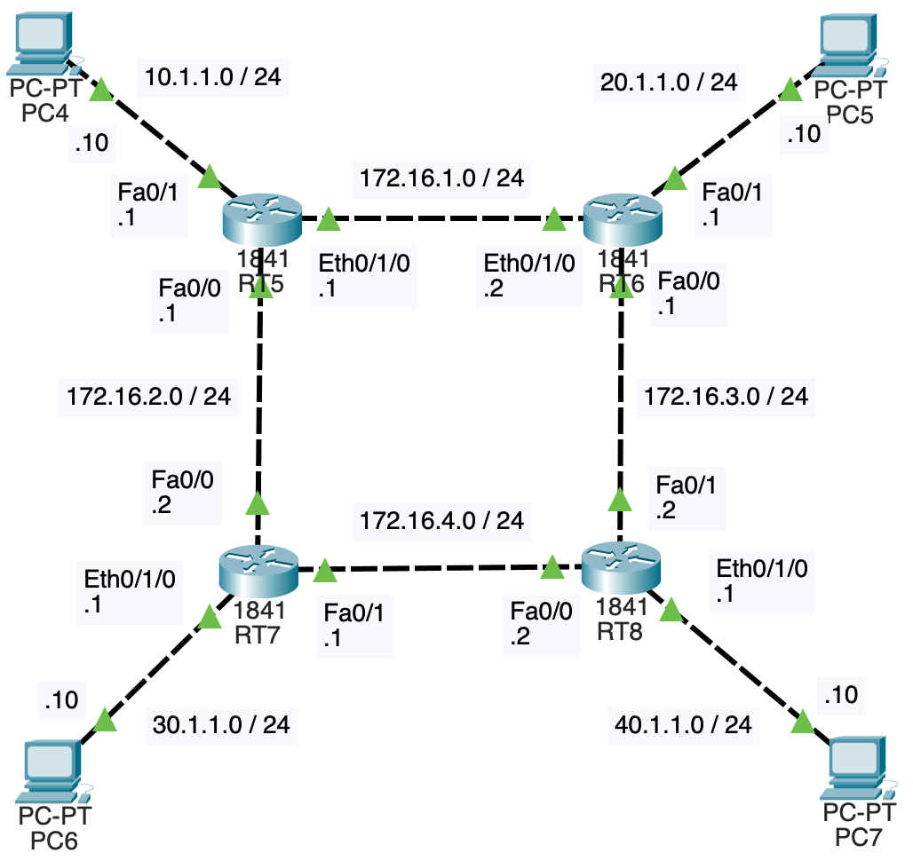

# NWの勉強
- ## OSPF
	- {:height 462, :width 413}
	- ((6616a07e-78a2-40e9-87ba-3a121c42c470)) と同じ構成にしてある
	- 各ルータにOSPFの設定を行う
		- ```
		  RT5(config)#router ospf 1
		  RT5(config-router)#network 10.1.1.0 0.0.0.255 area 0
		  RT5(config-router)#network 172.16.1.0 0.0.0.255 area 0
		  RT5(config-router)#network 172.16.2.0 0.0.0.255 area 0
		  ```
		- `router ospf 1`
			- OSPFプロセスを有効化する
			- 1はプロセスIDで、1~65535の範囲で指定し、他のルータを一致させる必要はない
		- `network 10.1.1.0 0.0.0.255 area 0`, `network 172.16.1.0 0.0.0.255 area 0`, `network 172.16.2.0 0.0.0.255 area 0`
			- 属するネットワークを指定する
			- 0.0.0.255はワイルドカードマスクである
				- 例えば、`network 172.16.1.0 0.0.0.255 area 0`, `network 172.16.2.0 0.0.0.255 area 0`, `network 172.16.3.0 0.0.0.255 area 0`の3つを指定する代わりに、`network 172.16.0.0 0.0.3.255 area 0`を指定することが出来る
			- areaの後にOSPFエリアを指定する
				- 今回はエリア0(バックボーンエリア)を指定している
	- ((660d7c07-9e35-42e2-945f-eff27ca50eba))
	- RIPとの違い
		- RT5とRT6はEthernet(10Mbps)で繋がっている
		- PC4からPC5に通信を飛ばす時、RIPではホップ数が最小になるような経路が選ばれるので、PC4 → RT5 → RT6 → PC5という経路になるが、OSPFではコストが最小になるような経路が選ばれるので、PC4 → RT5 → RT7 → RT8 → RT6 → PC5という経路になる
			- 
		- OSPFにおいて、RT5のルーティングテーブルは以下のようになっている
			- ```
			  RT5#show ip route
			  Codes: C - connected, S - static, I - IGRP, R - RIP, M - mobile, B - BGP
			         D - EIGRP, EX - EIGRP external, O - OSPF, IA - OSPF inter area
			         N1 - OSPF NSSA external type 1, N2 - OSPF NSSA external type 2
			         E1 - OSPF external type 1, E2 - OSPF external type 2, E - EGP
			         i - IS-IS, L1 - IS-IS level-1, L2 - IS-IS level-2, ia - IS-IS inter area
			         * - candidate default, U - per-user static route, o - ODR
			         P - periodic downloaded static route
			  
			  Gateway of last resort is not set
			  
			       10.0.0.0/24 is subnetted, 1 subnets
			  C       10.1.1.0 is directly connected, FastEthernet0/1
			       20.0.0.0/24 is subnetted, 1 subnets
			  O       20.1.1.0 [110/4] via 172.16.2.2, 00:01:26, FastEthernet0/0
			       30.0.0.0/24 is subnetted, 1 subnets
			  O       30.1.1.0 [110/11] via 172.16.2.2, 00:01:26, FastEthernet0/0
			       40.0.0.0/24 is subnetted, 1 subnets
			  O       40.1.1.0 [110/12] via 172.16.2.2, 00:01:26, FastEthernet0/0
			       172.16.0.0/24 is subnetted, 4 subnets
			  C       172.16.1.0 is directly connected, Ethernet0/1/0
			  C       172.16.2.0 is directly connected, FastEthernet0/0
			  O       172.16.3.0 [110/3] via 172.16.2.2, 00:01:26, FastEthernet0/0
			  O       172.16.4.0 [110/2] via 172.16.2.2, 00:01:26, FastEthernet0/0
			  ```
			- OSPFのAD値は110
			- コストの値はルータとPC間も含まれているようだ
				- RT7とPC6間、RT8とPC7間はEthernet(10Mbps)で繋がっている
					- PC側はFastEthernetのポートだが、ルータ側がEthernetのポートなので、10Mbpsで通信される
				- 例えば、40.1.1.0までのコストが12になっているのは、RT5からRT7でコスト1、RT7からRT8でコスト1、RT8からPC7でコスト10なので、合計12