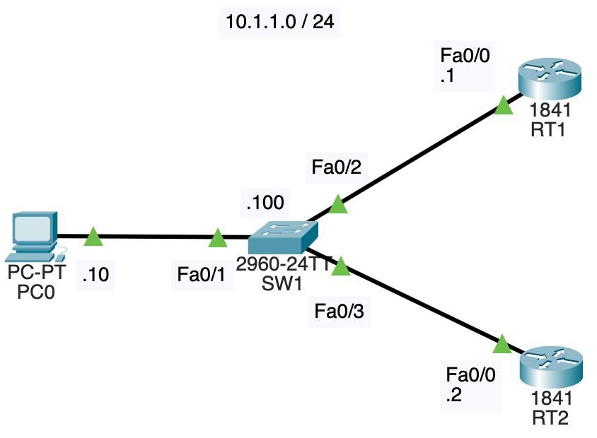
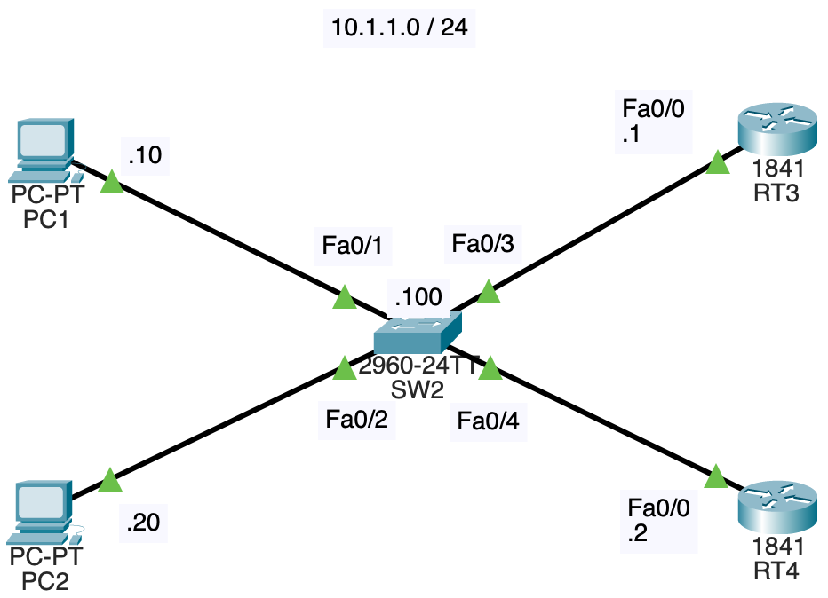
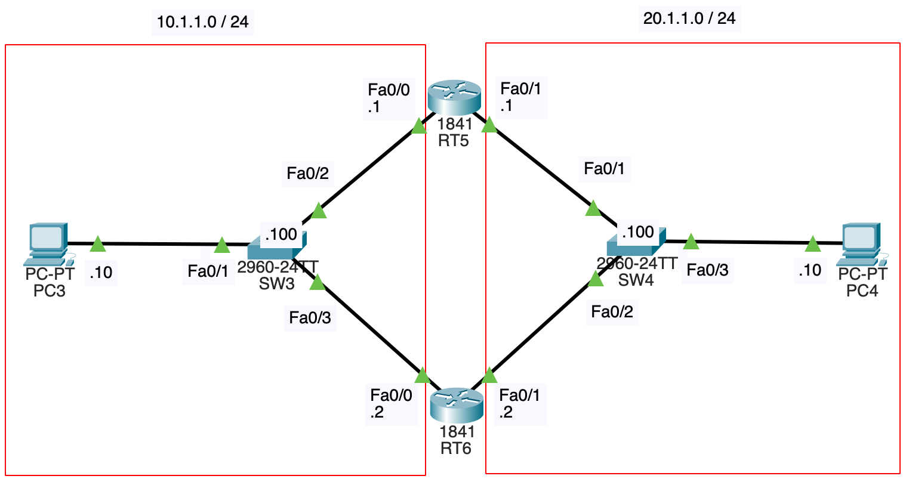

# NWの勉強
- ## VRRP
	- {:height 273, :width 379}
	- VRRP(Virtual Router Redundancy Protocol)とは、デフォルトゲートウェイを冗長化するためのプロトコルである
	- 上記のネットワーク構成において、PC0のデフォルトゲートウェイが10.1.1.1(RT1のFa0/0のIPアドレス)に設定されているとする
	- もしRT1が突然故障した時、PC0のデフォルトゲートウェイを10.1.1.2(RT2のFa0/0のIPアドレス)に変更しない限り、PC0は外部のネットワークと通信出来なくなる
	- RT1が突然故障した時、PC0のデフォルトゲートウェイを変更することなく、RT2を使われるようにするというのがVRRPのやることである
	- VRRPでは、複数のルータをまとめて、仮想ルータとして扱う
		- 仮想ルータは仮想IPアドレスと仮想MACアドレスを持つ
		- PCのデフォルトゲートウェイを仮想IPアドレスにしておけば、ルータの故障時にデフォルトゲートウェイを変更しなくて済む
		- 仮想MACアドレスは0000.5e00.01xxで、xxはグループ番号(後述)である
	- 仕組み
		- ルータ間でVRRP広告を送信し合う
		- VRRP広告にはプライオリティ値が含まれていて、プライオリティ値が最も高いルータがマスタルータとなり、その他のルータがバックアップルータとなる
			- 各ルータのVRRPの設定時にプライオリティ値を決める
			- 全てのルータのプライオリティ値が同じなら、IPアドレスが最大のルータがマスタルータとなる
		- マスタルータが仮想ルータ宛てのパケットを処理し、マスタルータの故障時はバックアップルータが役割を引き継ぐ
		- マスタルータは一定間隔でVRRP広告を送信し、バックアップルータはマスタルータからVRRP広告が来なくなると、故障したと判断し、役割を引き継ぐ
			- スイッチのMACアドレステーブルでは、仮想MACアドレスに、故障したルータと接続されているインタフェースが紐付いているため、役割を引き継いだルータと接続されているインタフェースに紐付け直す必要がある
			- これはVRRP広告やGARPで行う
				- GARP(Gratuitous ARP)は、自分自身のIPアドレスに対するARPで、他の機器に自身のIPアドレスが使われていないかの確認と、MACアドレステーブルを更新するという2つの役割を持つ([参考](https://www.infraexpert.com/study/tcpip3.5.html))
	- Cisco機器ではVRRPの設定が出来なくて、代わりにHSRP(Hot Standby Router Protocol)が用意されていて、これを使う
		- [VRRPとの違い](https://www.itbook.info/network/hsrp.html)
		- RT1
			- ```
			  RT1(config)#int fa0/0
			  RT1(config-if)#standby 1 ip 10.1.1.3
			  RT1(config-if)#standby 1 priority 105
			  RT1(config-if)#standby 1 preempt
			  ```
		- RT2
			- ```
			  RT2(config)#int fa0/0
			  RT2(config-if)#standby 1 ip 10.1.1.3
			  RT2(config-if)#standby 1 priority 100
			  RT2(config-if)#standby 1 preempt
			  ```
		- `standby 1 ip 10.1.1.3`
			- グループ番号と仮想IPアドレスを指定する
			- 異なる仮想IPアドレスを指定すると正しく動作しない
		- `standby 1 priority 105`, `standby 1 priority 100`
			- グループ番号とプライオリティ値を指定する(デフォルトのプライオリティ値は100)
			- RT1の方がRT2より高いので、RT1がアクティブルータになる(VRRPではマスタルータ/バックアップルータと呼ぶが、HSRPではアクティブルータ/スタンバイルータと呼ぶ)
		- `standby 1 preempt`
			- グループ番号を指定して、プリエンプト機能を有効にする
			- 既にアクティブルータが存在する時に、そのアクティブルータよりも高いプライオリティ値を持つルータが追加されても、アクティブルータは切り替わらないが、プリエンプト機能を有効にすることで、切り替わるようになる
		- PC0のデフォルトゲートウェイは仮想IPアドレスである10.1.1.3にする
	- PC0から20.1.1.10にpingを飛ばす
		- 20.1.1.10は到達不能だが、20.1.1.10を指定することでデフォルトゲートウェイに通信が飛ぶ
		- 
		- PC0は10.1.1.3のMACアドレスを知らないため、ARPリクエストを送信する
		- ARPリクエストはブロードキャストされ、アクティブルータであるRT1がARP応答を返す
		- PC0のARPテーブルは以下のようになる
			- ```
			  C:\>arp -a
			    Internet Address      Physical Address      Type
			    10.1.1.3              0000.0c07.ac01        dynamic
			  ```
			- HSRPの仮想MACアドレスは0000.0c07.acxxで、xxはグループ番号である
		- SW1のMACアドレステーブルは以下のようになる
			- ```
			  SW1#show mac-address-table
			            Mac Address Table
			  -------------------------------------------
			  
			  Vlan    Mac Address       Type        Ports
			  ----    -----------       --------    -----
			  
			     1    0000.0c07.ac01    DYNAMIC     Fa0/2
			     1    0002.1636.7801    DYNAMIC     Fa0/3
			     1    000a.4143.015b    DYNAMIC     Fa0/1
			     1    00e0.8f56.8c01    DYNAMIC     Fa0/2
			  ```
			- 0000.0c07.ac01はARP応答によって学習、0002.1636.7801, 00e0.8f56.8c01はHSRP Hello(VRRPにおけるVRRP広告)によって学習される
	- RT1のFa0/0を落とすと、RT2がアクティブルータに切り替わる
		- ```
		  RT1(config)#int fa0/0
		  RT1(config-if)#shut 
		  ```
		- MACアドレステーブル中で0000.0c07.ac01に紐付くインタフェースがFa0/3に変更される
			- ```
			  SW1#show mac-address-table
			            Mac Address Table
			  -------------------------------------------
			  
			  Vlan    Mac Address       Type        Ports
			  ----    -----------       --------    -----
			  
			     1    0000.0c07.ac01    DYNAMIC     Fa0/3
			     1    0002.1636.7801    DYNAMIC     Fa0/3
			     1    000a.4143.015b    DYNAMIC     Fa0/1
			  ```
	- 複数の仮想ルータを使った負荷分散
		- {:height 296, :width 432}
		- RT3とRT4で2つの仮想ルータを設定する
			- RT3
				- ```
				  RT3(config-if)#standby 1 ip 10.1.1.3
				  RT3(config-if)#standby 1 priority 105
				  RT3(config-if)#standby 1 preempt
				  RT3(config-if)#standby 2 ip 10.1.1.4
				  RT3(config-if)#standby 2 priority 100
				  RT3(config-if)#standby 2 preempt
				  ```
			- RT4
				- ```
				  RT4(config-if)#standby 1 ip 10.1.1.3
				  RT4(config-if)#standby 1 priority 100
				  RT4(config-if)#standby 1 preempt
				  RT4(config-if)#standby 2 ip 10.1.1.4
				  RT4(config-if)#standby 2 priority 105
				  RT4(config-if)#standby 2 preempt
				  ```
			- グループ番号1は、仮想IPアドレスが10.1.1.3で、RT3をアクティブルータとする
			- グループ番号2は、仮想IPアドレスが10.1.1.4で、RT4をアクティブルータとする
		- PC1のデフォルトゲートウェイを10.1.1.3、PC2のデフォルトゲートウェイを10.1.1.4とすることで、ルータ間で負荷分散を行いつつ、冗長化も出来る
	- VRRPトリガ
		- {:height 336, :width 600}
		- RT5のFa0/0とRT6のFa0/0で仮想ルータを設定し、仮想IPアドレスを10.1.1.3にし、PC3のデフォルトゲートウェイとしている
		- RT5のFa0/1とRT6のFa0/1で仮想ルータを設定し、仮想IPアドレスを20.1.1.3にし、PC4のデフォルトゲートウェイとしている
		- どちらの仮想ルータにおいても、RT5のプライオリティ値を105、RT6のプライオリティ値を100としており、RT5がアクティブルータになる
		- RT5のFa0/0が故障すると、10.1.1.0/24側ではRT6がアクティブルータに切り替わるが、20.1.1.0/24側では以前RT5がアクティブルータのままである
		- そのため、以下のようにPC3とPC4が通信出来なくなる
			- 
		- これを回避するためにVRRPトリガを使う(HSRPではトラックという)([参考](https://shinmeisha.co.jp/newsroom/2020/04/03/cisco-hsrp-%E3%81%AE%E5%9F%BA%E6%9C%AC%E8%A8%AD%E5%AE%9A/))
			- ```
			  RT5(config)#int fa0/1
			  RT5(config-if)#standby 1 track fa0/0
			  ```
			- RT5のFa0/1側でFa0/0を監視し、Fa0/0が故障したら、自身のプライオリティ値を下げる(デフォルトでは10下げる)
			- これによって、RT5のFa0/1のプライオリティ値が95になり、RT6のFa0/1のプライオリティ値である100を下回るので、20.1.1.0/24側のアクティブルータがRT6になる
			- 