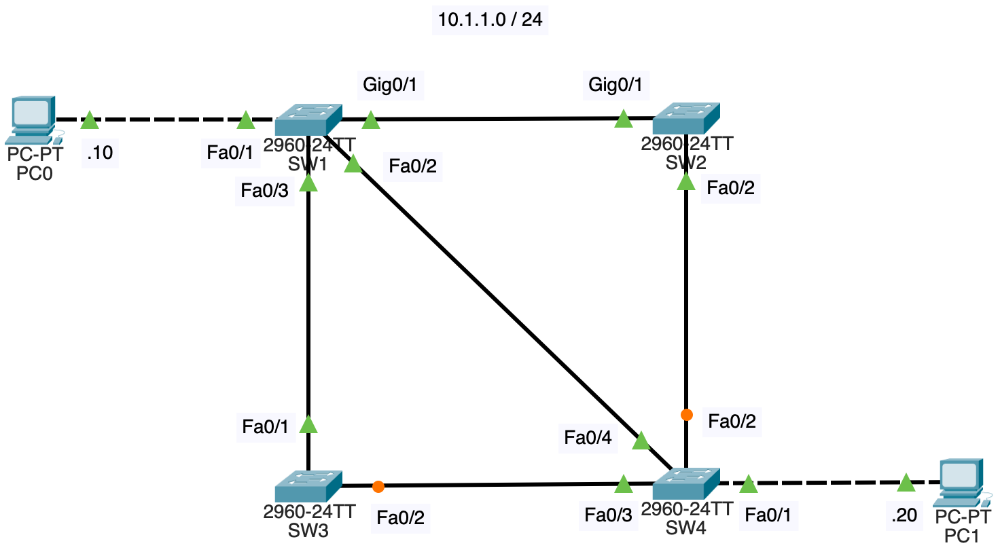
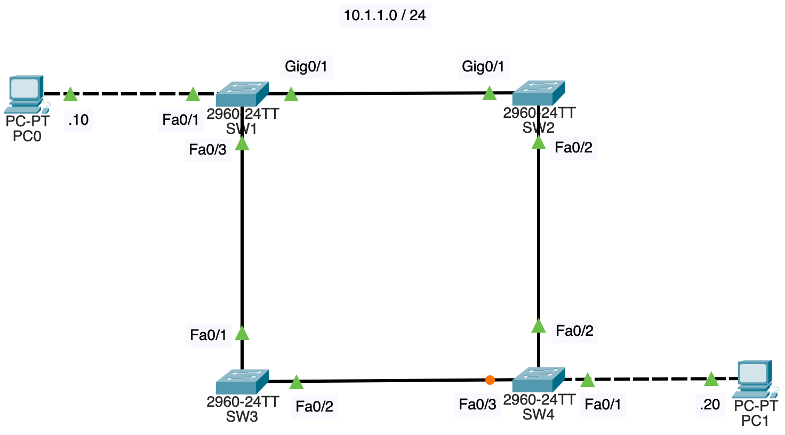

# NWの勉強
- ## STP
	- {:height 328, :width 625}
	- STP(Spanning Tree Protocol)とは、スイッチが冗長化されている時にブロードキャストストームを防ぐためのプロトコルである
		- デフォルトで有効化されている
	- ブロードキャストストーム
		- 同じフレームがスイッチ間で無限に送信され続けること
		- 上記のネットワーク構成において、PC0からPC1に通信を行う時に、PC0からARPリクエストが送信されるが、SW1はこれをGig0/1から送信(Fa0/2, Fa0/3からも送信) → SW2がFa0/2から送信 → SW4がFa0/4から送信(Fa0/1, Fa0/3からも送信) →再度SW1がGig0/1から送信 → ... というように、ARPリクエストが無限に送信され続ける
	- 閉路が出来ていると、ブロードキャストストームが発生する
	- STPでは一部のスイッチのポート(インタフェース)をブロックし、閉路を無くす
		- 障害発生時はブロックしていたポートを有効化する
	- 仕組み([参考](https://www.infraexpert.com/study/stpz1.html))
		- ルートブリッジの選出
			- ブリッジは、とりあえずスイッチと読み替えて良いだろう
			- スイッチ間でBPDU(Bridge Protocol Data Unit)と呼ばれるフレームを交換し合う
			- BPDUの中にはBridge IDと呼ばれる値があり、Bridge IDが最小のスイッチがルートブリッジとなる
			- Bridge IDは8バイトの値で、2バイトのプライオリティ値と6バイトのMACアドレスからなる
				- 今回はSW1がルートブリッジとなっている
		- ルートポートの選出
			- ルートブリッジ以外の各ブリッジについて、ルートブリッジに最も近いポートをルートポートとする
			- コストは、Ethernet(10Mbps)が100、FastEthernet(100Mbps)が19, GigabitEthernet(1Gbps)が4である
			- SW2の場合、Gig0/1のコストが4、Fa0/2のコストが38なので、Gig0/1がルートポート
			- SW3の場合、Fa0/1のコストが19、Fa0/2のコストが38なので、Fa0/1がルートポート
			- SW4の場合、Fa0/2のコストが23、Fa0/3のコストが38、Fa0/4のコストが19なので、Fa0/4がルートポート
		- 代表ポート(指定ポート)の選出
			- 各セグメント(スイッチ間のケーブル)について、ルートブリッジにより近いポートを代表ポートとする
			- SW1,SW2間、SW1,SW3間、SW1,SW4間については全てSW1側のポートが代表ポートになる
			- SW2,SW4間では、SW2のFa0/2が代表ポートになる
				- ルートポートの選出では、SW2のFa0/2のコストが38、SW4のFa0/2のコストが23だったので、SW4のFa0/2が代表ポートになるかのように思われるが、比較するのは、SW2の中で最小のコストとSW4の中で最小のコストになる
				- SW2の中で最小のコストはGig0/1の4、SW4の中で最小のコストはFa0/4の19で、SW2の方が小さいので、SW2のFa0/2が代表ポートになる
			- SW3,SW4間では、どちらも代表ポートになって良いが、SW4のFa0/3が代表ポートになっている
		- ルートポートにも代表ポートにも選ばれなかったポートは、ブロックキングポート(非指定ポート)になる
			- SW3のFa0/2とSW4のFa0/2がブロッキングポートになっている
		- [練習問題](https://xtech.nikkei.com/it/article/COLUMN/20100219/344833/)
	- `show spanning-tree`で各ポートの状態を確認出来る
		- SW4の例
			- ```
			  SW4#show spanning-tree 
			  VLAN0001
			    Spanning tree enabled protocol ieee
			    Root ID    Priority    32769
			               Address     000A.418A.CE35
			               Cost        19
			               Port        4(FastEthernet0/4)
			               Hello Time  2 sec  Max Age 20 sec  Forward Delay 15 sec
			  
			    Bridge ID  Priority    32769  (priority 32768 sys-id-ext 1)
			               Address     0050.0FC8.8AA1
			               Hello Time  2 sec  Max Age 20 sec  Forward Delay 15 sec
			               Aging Time  20
			  
			  Interface        Role Sts Cost      Prio.Nbr Type
			  ---------------- ---- --- --------- -------- --------------------------------
			  Fa0/1            Desg FWD 19        128.1    P2p
			  Fa0/2            Altn BLK 19        128.2    P2p
			  Fa0/3            Desg FWD 19        128.3    P2p
			  Fa0/4            Root FWD 19        128.4    P2p
			  ```
	- 以下のようにブロッキングポートからはARPリクエストが送信されない
		- 
	- SW1,SW4間のケーブルを無くすと、ブロッキングポートであったSW3のFa0/2が代表ポートになり有効化される
		- {:height 407, :width 662}
		- RSTP(Rapid Spanning Tree Protocol)では、このようなトポロジーの変化時に、普通のSTPよりも収束が早い([参考](https://www.infraexpert.com/study/stpz8.html))
		- RSTPではブロッキングポートを代替ポートとバックアップポートに分け、どちらも通常時は使用されないが、代替ポートはルートポートのダウンを検知し、役割を引き継ぐ & バックアップポートは代表ポートのダウンを検知し、役割を引き継ぐ
		- ルートポートと代表ポートで役割が違うのだろうか？