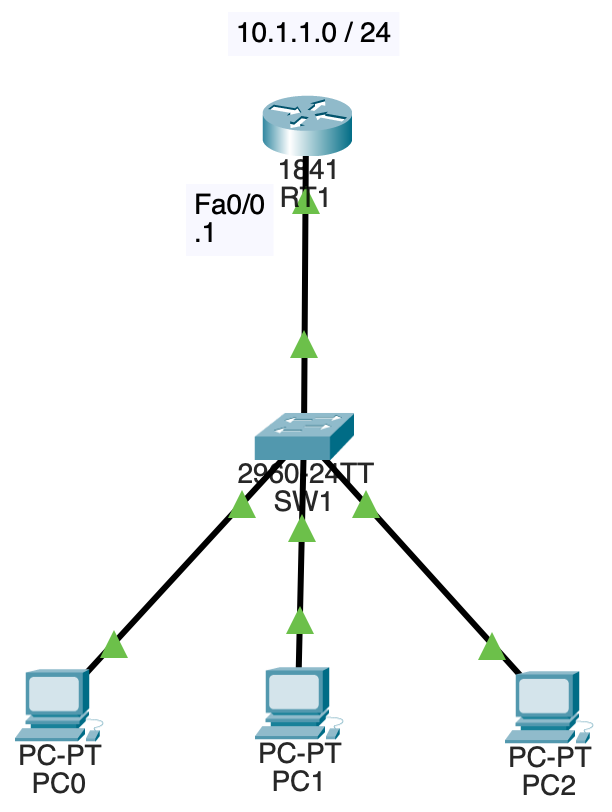
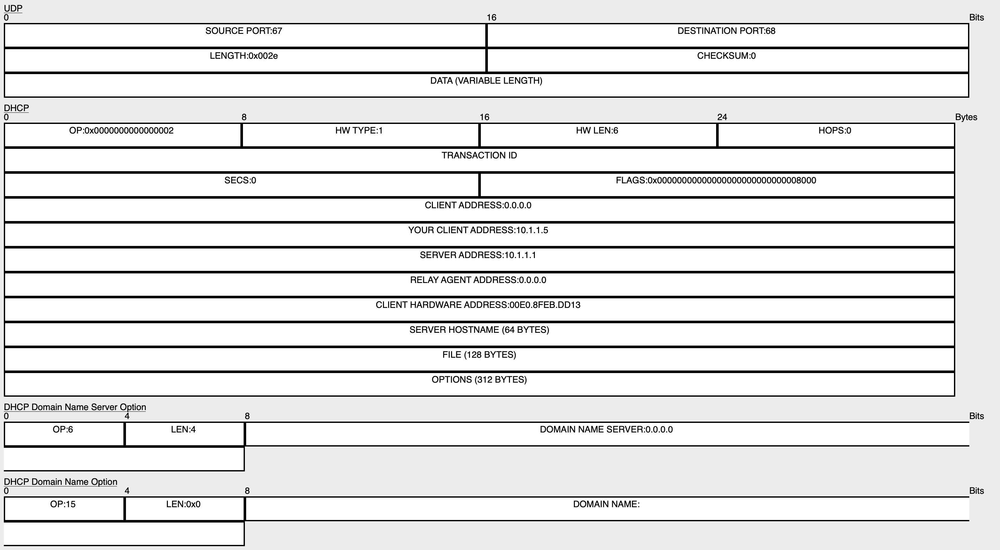
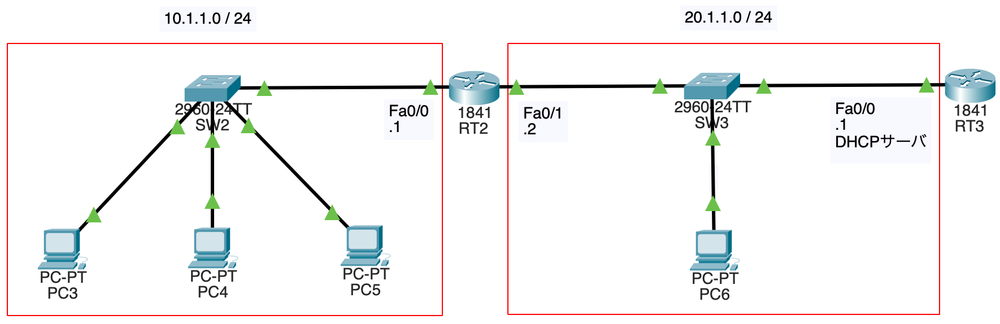

# NWの勉強
- ## DHCP
	- {:height 368, :width 285}
	- DHCP(Dynamic Host Configuration Protocol)とは、ネットワーク接続するのに必要なIPアドレスなどの情報を自動的に割り当てるためのプロトコルである
	- ARPはデータリンク層のプロトコルだったが、DHCPはアプリケーション層のプロトコルである
	- 設定
		- RT1をDHCPサーバとし、PC0, PC1, PC2, SW1にIPアドレスとデフォルトゲートウェイをDHCPで設定する
		- PCはSettings → Gateway/DNS IPv4をDHCPにする & FastEthernet0 → IP ConfigurationをDHCPにする
		- SW1
			- ```
			  SW1(config)#int vlan1
			  SW1(config-if)#ip address dhcp
			  SW1(config-if)#no shut
			  ```
		- RT1
			- ```
			  RT1(config)#ip dhcp pool LAN1
			  RT1(dhcp-config)#network 10.1.1.0 255.255.255.0
			  RT1(dhcp-config)#default-router 10.1.1.1
			  ```
			- `ip dhcp pool LAN1`
				- DHCPプール(クライアントに割り振るIPアドレスの集合)を作成する
				- LAN1はDHCPプールの名前で何でも良い
			- `network 10.1.1.0 255.255.255.0`
				- DHCPクライアントのネットワークを指定する
			- `default-router 10.1.1.1`
				- デフォルトゲートウェイを指定する
			- 他にも、DNSサーバやリース期間(デフォルトは24時間)などを設定することが可能
			- 手動で設定されているIPアドレスは割り当てないようにプールから除外しておく必要がある
	- ((6520471c-18e8-4e32-b9de-ff82198b12be))
	- PC0 → PC1 → SW1の順でDHCPを使う設定をすると、PC0に10.1.1.2、PC1に10.1.1.3、SW1に10.1.1.4が割り当てられる
	- この状態でPC2でDHCPを使う設定をすると、以下のような通信が発生する(表示するのはARPとDHCPだけにしている)
		- 
		- 最終的にPC2に10.1.1.5が割り当てられる
		- PC2がDHCP発見パケット(DHCP DISCOVER)をブロードキャストした後に、RT1がARPリクエストをブロードキャストしている
			- ARPリクエストの中身を確認すると、10.1.1.5を対象としたARPリクエストだったので、これから割り当てようとするIPアドレスが他のPCに使われていないかを確認するためのARPリクエストだと考えられる
		- DHCP提供パケット(DHCP OFFER)はユニキャストのはずだが、ブロードキャストされている
			- [ここ](https://www.cisco.com/c/ja_jp/support/docs/ip/dynamic-address-allocation-resolution/27470-100.html)を見ると、DHCP OFFERとDHCP ACKはブロードキャストされると書いてあるので、Cisco機器ではブロードキャストされる仕様らしい
		- DHCP要求パケット(DHCP REQUEST)はブロードキャストされる
		- DHCP確認応答パケット(DHCP ACK)はユニキャストのはずだが、ブロードキャストされている
		- DHCP ACKを受け取ったPC2は自身のIPアドレス(10.1.1.5)を対象にして、ARPリクエストを送信する(Gratuitous ARP)
		- DHCP確認応答パケットの中身は以下のようになっている([参考](https://milestone-of-se.nesuke.com/l7protocol/dhcp/dhcp-format/))
			- {:height 372, :width 708}
			- アプリケーション層のプロトコルなので、DHCPのデータの手前にUDPヘッダが存在している
			- OPが1だとDHCPクライアントからのメッセージで、OPが2だとDHCPサーバからのメッセージ
			- YOUR CLIENT ADDRESSがDHCPサーバによって割り当てられるIPアドレス
			- デフォルトゲートウェイのIPアドレスはDHCP確認応答パケットの中身に含まれるが([参考](https://www.infraexpert.com/study/tcpip13.html))、どこに含まれているのか分からない
				- SERVER ADDRESSではない(RT1で`default-router 10.1.1.100`にしても変わらず10.1.1.1だったので)
	- DHCPリレーエージェント
		- 自身が属するネットワークの外側にDHCPサーバがある場合(=DHCPサーバまでにルータを介する場合)、通常はDHCP発見パケットがルータで破棄されてしまい、DHCPサーバまで届かないため、ルータにDHCPリレーエージェントの設定を行う必要がある
		- {:height 295, :width 855}
		- RT3をDHCPサーバとする
			- ```
			  RT3(config)#ip route 10.1.1.0 255.255.255.0 20.1.1.2
			  RT3(config)#ip dhcp pool LAN1
			  RT3(dhcp-config)#network 10.1.1.0 255.255.255.0
			  RT3(dhcp-config)#default-router 10.1.1.1
			  RT3(dhcp-config)#ip dhcp pool LAN2
			  RT3(dhcp-config)#network 20.1.1.0 255.255.255.0
			  RT3(dhcp-config)#default-router 20.1.1.1
			  ```
			- LAN1はPC3, PC4, PC5, SW2用のDHCPプールで、LAN2はPC6, SW3用のDHCPプール
			- ルーティングテーブルに10.1.1.0/24を登録しておかないと、10.1.1.0/24内の機器からのDHCP発見パケットに対してDHCP提供パケットを返せない
		- RT2にDHCPリレーエージェントの設定をする
			- ```
			  RT2(config)#int fa0/0
			  RT2(config-if)#ip helper-address 20.1.1.1
			  ```
			- `ip helper-address`の後にDHCPサーバのIPアドレスを指定する
			- 設定するインターフェースに注意(Fa0/1に設定しても意味がない)
		- 10.1.1.0/24が送信元のDHCP発見パケット/DHCP要求パケットは10.1.1.0/24内ではブロードキャストされるが、ネットワーク外ではユニキャストで送信される(L2ヘッダの送信先MACアドレスがRT3のFa0/0のMACアドレスになっている)
			- 
			- ネットワーク外ではDHCP提供パケット/DHCP確認応答パケットもユニキャストになっている
			- DHCP要求パケットの後にRT2からARPリクエストが送信されているのが不思議(RT2は割り当てられるIPアドレスを知らないはずなのに、最終的にPC3に割り当てられるIPアドレスを対象としてARPリクエストを送信している)
	- DHCPスヌーピング
		- 不正な端末がDHCPサーバになりすまして、デフォルトゲートウェイを自身のIPアドレスにしてDHCP確認応答パケットを返せば、中間者攻撃が可能である([参考](https://www.n-study.com/security-fundamentals/dhcp-spoofing/))
			- これをDHCPスプーフィングと呼ぶ
			- 他にもARPスプーフィングやDNSスプーフィングで中間者攻撃が可能([参考](https://www.gmo.jp/security/cybersecurity/cyberattack/blog/mitm/))
		- DHCPスヌーピングでは、スイッチの各ポートをtrustedとuntrustedに分け、DHCPサーバからのメッセージがuntrustedなポートに届いた場合は破棄する([参考1](https://ja.wikipedia.org/wiki/DHCP%E3%82%B9%E3%83%8C%E3%83%BC%E3%83%94%E3%83%B3%E3%82%B0), [参考2](https://www.infraexpert.com/study/dhcp4.htm))
			- 不正な端末がDHCP確認応答パケットを送信しても破棄されるので、これでDHCPスプーフィングを防げる
			- スヌーピングは覗き見という意味(パケットの中身を見て破棄するか判定をしている)