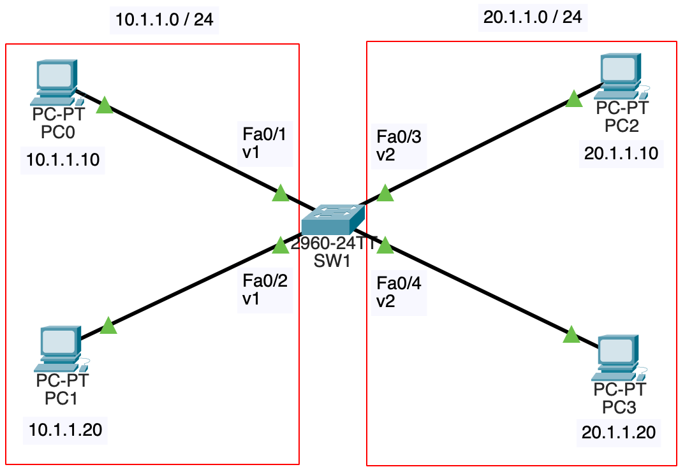
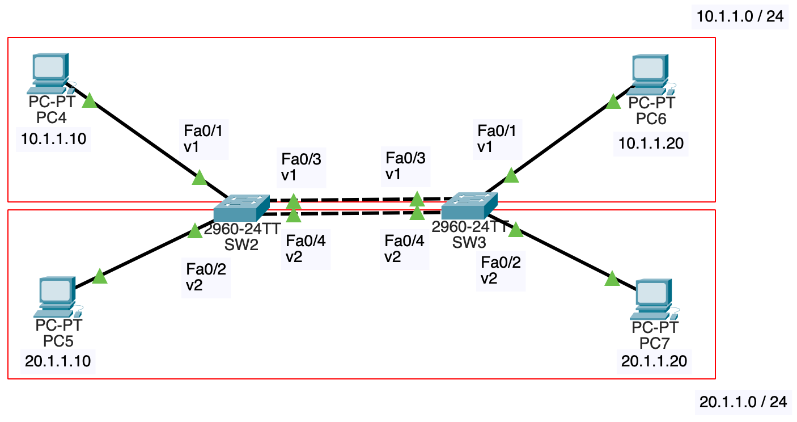
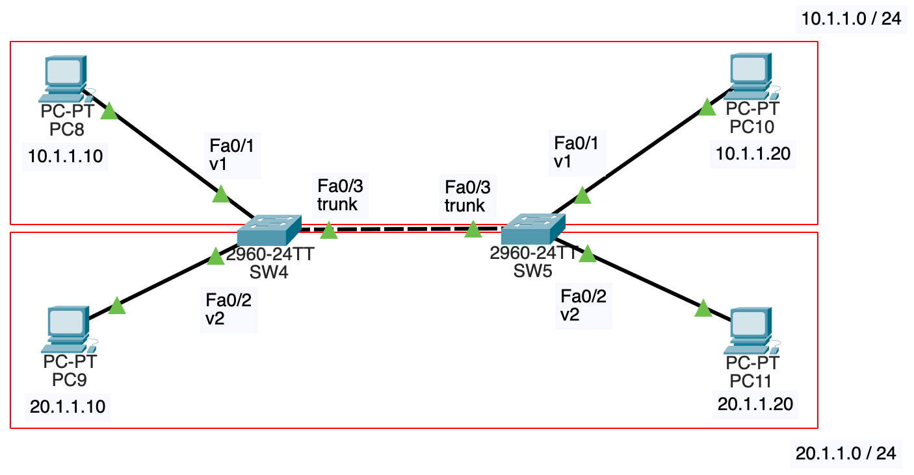
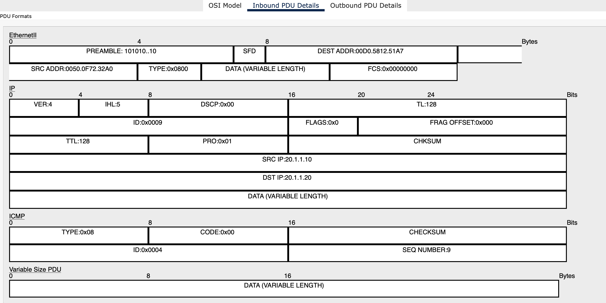
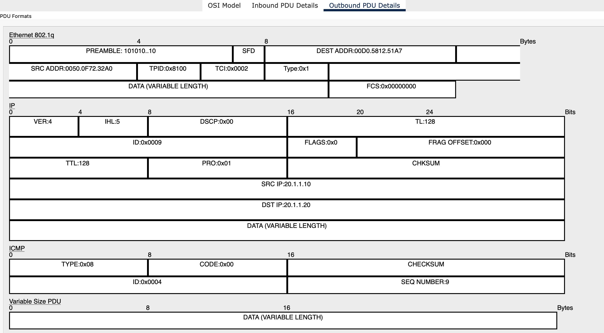

# NWの勉強
- ## VLAN
	- {:height 308, :width 453}
	- VLAN(Virtual LAN)はスイッチで仮想的にネットワークを分割するための技術
	- 上記のネットワーク構成において、VLANが設定されていない状態だと、PC0, PC1, PC2, PC3は同一のブロードキャストドメインに属する
		- 例えば、PC0からARPリクエストを送信すると、PC1, PC2, PC3に届く
	- しかしVLANを設定することで、ブロードキャストドメインを分割し、PC0とPC1が属するブロードキャストドメイン、PC2とPC3が属するブロードキャストドメインの2つに分割するといったことが可能
		- PC0からARPリクエストを送信すると、PC1には届くが、PC2, PC3には届かない
		- 
	- SW1の各インターフェースにVLANを設定する
		- デフォルトでVLAN1が存在し、初めは全てのインタフェースがVLAN1に属している
			- ```
			  SW1#show vlan
			  
			  VLAN Name                             Status    Ports
			  ---- -------------------------------- --------- -------------------------------
			  1    default                          active    Fa0/1, Fa0/2, Fa0/3, Fa0/4
			                                                  Fa0/5, Fa0/6, Fa0/7, Fa0/8
			                                                  Fa0/9, Fa0/10, Fa0/11, Fa0/12
			                                                  Fa0/13, Fa0/14, Fa0/15, Fa0/16
			                                                  Fa0/17, Fa0/18, Fa0/19, Fa0/20
			                                                  Fa0/21, Fa0/22, Fa0/23, Fa0/24
			                                                  Gig0/1, Gig0/2
			  1002 fddi-default                     active    
			  1003 token-ring-default               active    
			  1004 fddinet-default                  active    
			  1005 trnet-default                    active
			  ```
		- Fa0/1, Fa0/2はVLAN1のままにし、Fa0/3, Fa0/4にVLAN2を設定する
			- ```
			  SW1(config)#vlan 2
			  SW1(config-vlan)#exit
			  SW1(config)#int fa0/3
			  SW1(config-if)#switchport mode access
			  SW1(config-if)#switchport access vlan 2
			  SW1(config-if)#int fa0/4
			  SW1(config-if)#switchport mode access
			  SW1(config-if)#switchport access vlan 2
			  SW1(config-if)#exit
			  SW1(config)#exit
			  SW1#show vlan
			  
			  VLAN Name                             Status    Ports
			  ---- -------------------------------- --------- -------------------------------
			  1    default                          active    Fa0/1, Fa0/2, Fa0/5, Fa0/6
			                                                  Fa0/7, Fa0/8, Fa0/9, Fa0/10
			                                                  Fa0/11, Fa0/12, Fa0/13, Fa0/14
			                                                  Fa0/15, Fa0/16, Fa0/17, Fa0/18
			                                                  Fa0/19, Fa0/20, Fa0/21, Fa0/22
			                                                  Fa0/23, Fa0/24, Gig0/1, Gig0/2
			  2    VLAN0002                         active    Fa0/3, Fa0/4
			  1002 fddi-default                     active    
			  1003 token-ring-default               active    
			  1004 fddinet-default                  active    
			  1005 trnet-default                    active
			  ```
			- `switchport mode access`はインターフェースをアクセスポートにすることを意味し、`switchport access vlan 2`はアクセスポートをVLAN2にしている(アクセスポートについては後述)
	- VLANのメリット([参考](https://www.infraexpert.com/study/vlanz1.html))
		- ブロードキャストドメインが分割されることで
			- 無駄な通信が減る
			- セキュリティの向上(ARPスプーフィングのリスクが減るなど([参考](https://milestone-of-se.nesuke.com/nw-basic/ethernet/vlan/)))
		- 柔軟にネットワーク構成を変更可能
			- 例えば、10.1.1.0/24が営業部で、20.1.1.0/24が技術部だとする
			- PC0を技術部に配置したいとなったら、SW1のFa0/1をVLAN2に変更し、PC0のIPアドレスを20.1.1.30などに変更すれば良い
				- 物理的な配置にとらわれない(別のスイッチに配線し直す必要がない)
	- ここまでで書いたのは、アクセスポートと呼ばれる、1つのVLANに属するポート(インターフェース)のことである
	- 以下のようなネットワーク構成では、VLAN毎に、SW2とSW3の間のリンクを作成する必要がある
		- {:height 311, :width 696}
		- VLANを設定していない場合は、SW2とSW3でSTPが動き、4個あるインターフェースのうち、1個が非指定ポートになるが、今回それが起こってしまうと、VLAN1内かVLAN2内のどちらかで通信が出来なくなってしまう
		- STPはVLANを考慮して動いていることが分かる
	- トランクポートを使えば、VLANが増えても、SW2とSW3の間のリンクは1つで良い
	- トランクポートとは複数のVLANに属するポートのことである([参考](https://www.infraexpert.com/study/vlanz2.html))
		- {:height 384, :width 691}
		- SW4
			- ```
			  SW4(config)#vlan 2
			  SW4(config-vlan)#exit
			  SW4(config)#int fa0/2
			  SW4(config-if)#switchport mode access
			  SW4(config-if)#switchport access vlan 2
			  SW4(config)#int fa0/3
			  SW4(config-if)#switchport mode trunk
			  ```
			- SW5も同様に設定
		- VLANを識別するために ((660ae19f-54fb-48da-96f2-7e632458cea0)) の送信元MACアドレスとタイプの間にVLAN IDが挿入される
		- PC9からPC11にpingを飛ばした時の行きの経路でSW4を通過するパケットのL2ヘッダを確認する
			- Inbound
				- {:height 313, :width 670}
				- この時点ではVLAN IDは挿入されていない
			- Outboud
				- {:height 425, :width 668}
				- TPIDとTCIが追加されている
				- TPIDはトランキングプロトコルを表す値で、TCIは下位12ビットがVLAN IDを表す([参考](https://www.infraexpert.com/study/vlanz2.html))
		- ネイティブVLANの場合は、VLAN IDが挿入されないという仕様がある
			- ネイティブVLANは各インターフェースに設定し、デフォルトは1
		- つまり、PC8からPC10にpingを飛ばした時はL2ヘッダにVLAN IDは挿入されない
		- VLAN IDがないデータを受け取ったスイッチは、自身のネイティブVLANにデータを転送する
		- SW4のFa0/3とSW5のFa0/3でネイティブVLANを揃えておかないと、VLANを跨いで通信が可能になってしまう
		  id:: 661ffc91-3699-42c5-b524-062eb19e9a1d
			- SW4のFa0/3のネイティブVLANは1のままにし、SW5のFa0/3のネイティブVLANは2にする
				- ```
				  SW5(config)#int fa0/3
				  SW5(config-if)#switch trunk native vlan 2
				  ```
			- しかし、STPによってネイティブVLANが違うことが検知され、SW4のFa0/3がブロックされてしまう
				- ```
				  %SPANTREE-2-RECV_PVID_ERR: Received BPDU with inconsistent peer vlan id 2 on FastEthernet0/3 VLAN1.
				  %SPANTREE-2-BLOCK_PVID_LOCAL: Blocking FastEthernet0/3 on VLAN0001. Inconsistent local vlan.
				  ```
			- SW4側でSTPを無効する
				- ```
				  SW4(config)#no spanning-tree vlan 1
				  SW4(config)#no spanning-tree vlan 2
				  ```
			- ここまで行うと、以下のように、PC8からPC10にpingを飛ばす時にARPリクエストが発生すると、VLAN1に属するPC8とVLAN2に属するPC11がしてしまう
				- 