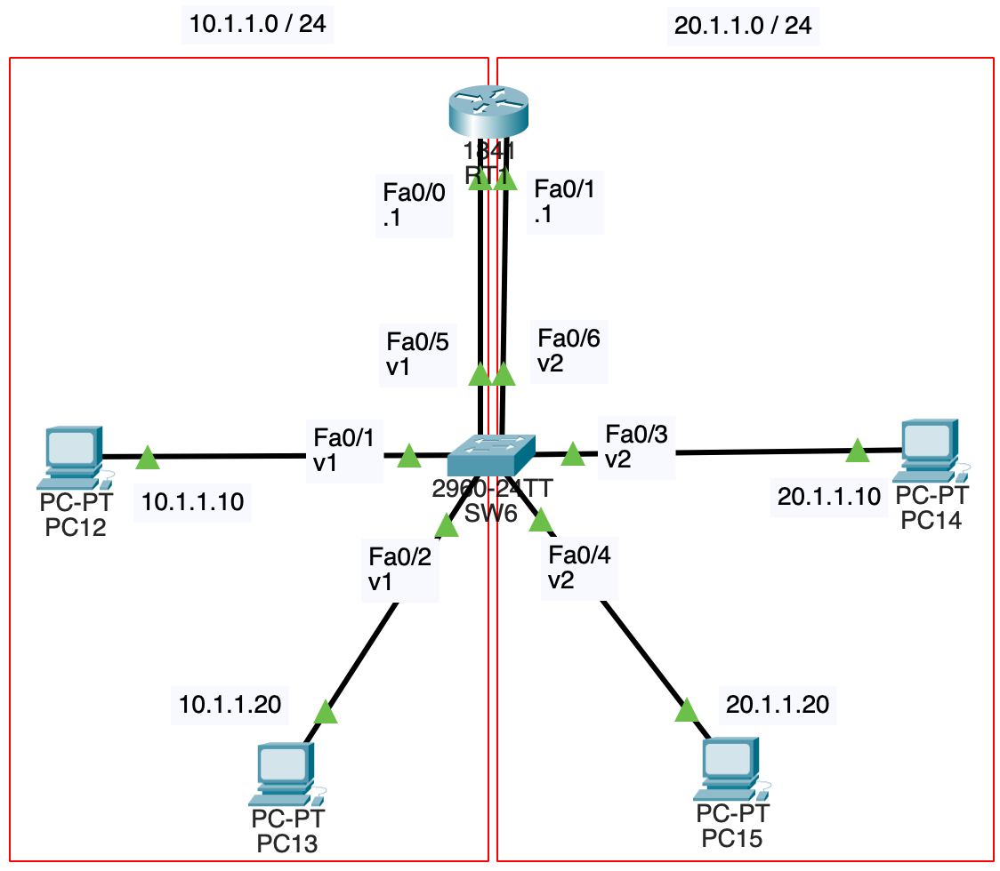
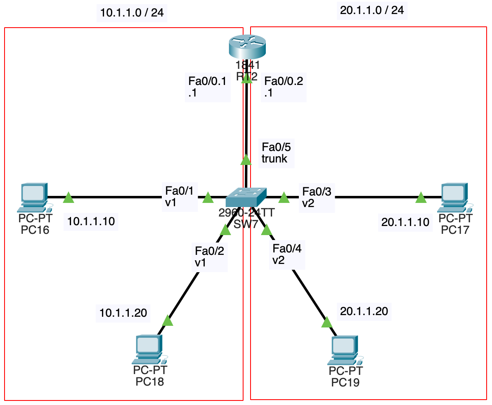
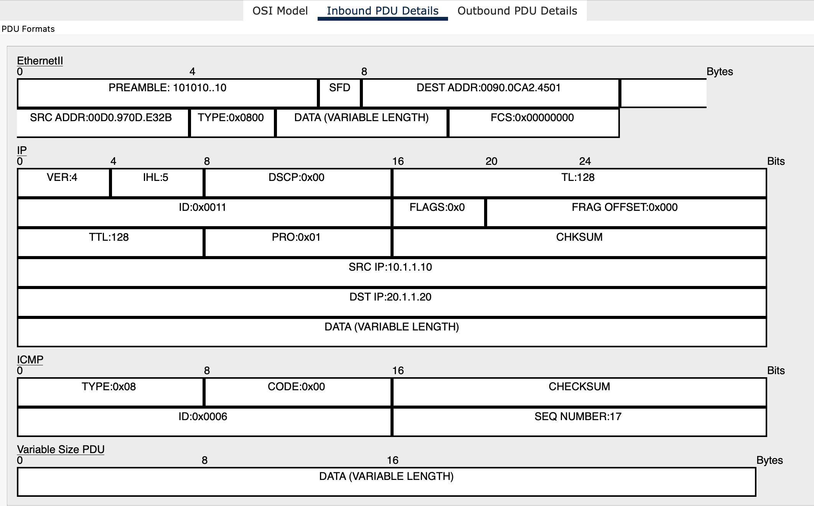
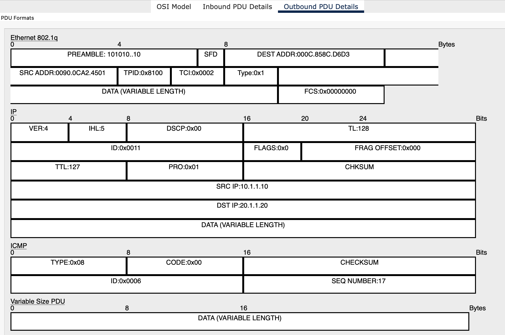
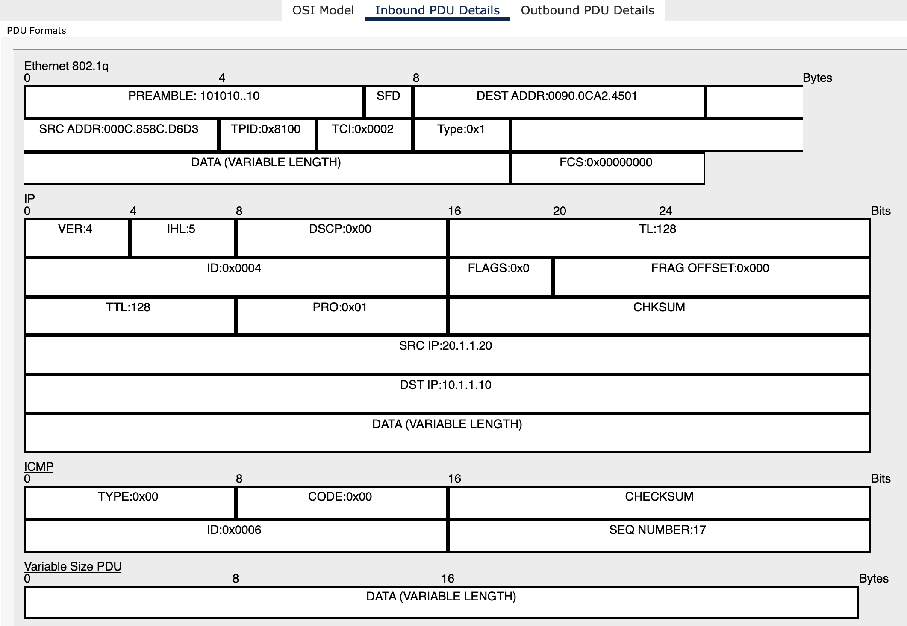
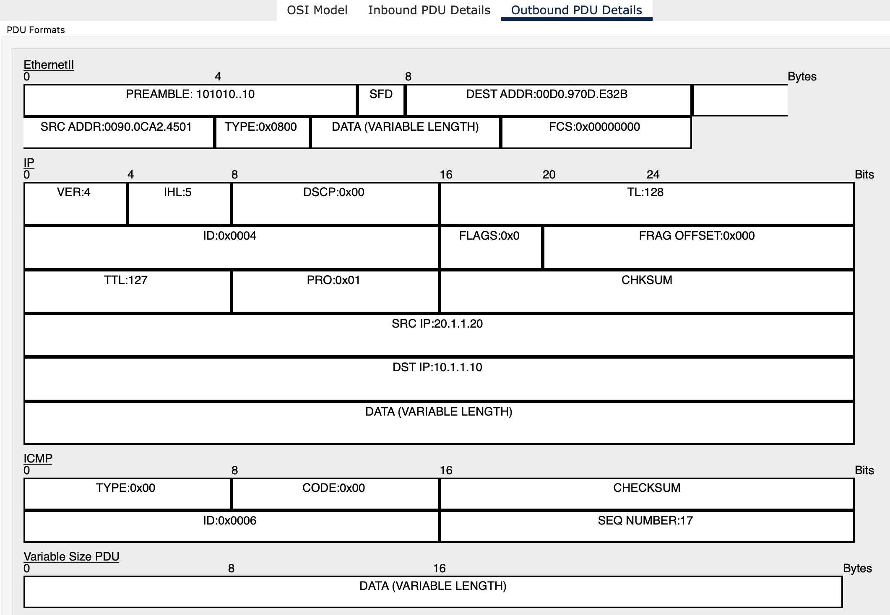

# NWの勉強
- ## VLAN続き
	- {:height 505, :width 464}
	- VLAN間で通信を行う場合はルータを用いる
	- PC12からPC15にpingを飛ばす場合は以下のような通信になる
		- 
	- 別にVLAN使わなくても、ルータとスイッチを使えば同様のネットワークを構成出来るが、VLANを使うことで、例えばPC12をVLAN2に移動させたい時に、SW6のFa0/1をVLAN2に変更し、PC12のIPアドレスを20.1.1.30などに変更するだけで良くなる
		- VLANを使わない場合は、PC12を別のスイッチに配線し直す必要がある
	- どうせVLAN間で通信するなら、PC12~PC15を全て同じネットワークに所属させれば良いのではと思ったが、VLANを使うことで、ブロードキャストドメインの分割が出来て無駄な通信が減るのと、ARPスプーフィングの防止などセキュリティが向上するというメリットがある
	- 上記のネットワーク構成では、VLANの数だけRT1とSW6の間にリンクが必要になるというデメリットがある
	- この時に使うのがRouter on a stickと呼ばれる技術である([参考](https://atmarkit.itmedia.co.jp/ait/articles/1509/17/news025.html))
		- ルータの1つのインタフェースを複数のサブインタフェースと呼ばれるものに分割する
		- {:height 524, :width 493}
		- 上記のネットワーク構成ではRT2のFa0/0をFa0/0.1とFa0/0.2の2つのサブインタフェースに分割している
		- 設定
			- ```
			  RT2(config)#int fa0/0
			  RT2(config-if)#no shut
			  RT2(config-if)#int fa0/0.1
			  RT2(config-subif)#encapsulation dot1q 1
			  RT2(config-subif)#ip address 10.1.1.1 255.255.255.0
			  RT2(config-subif)#int fa0/0.2
			  RT2(config-subif)#encapsulation dot1q 2
			  RT2(config-subif)#ip address 20.1.1.1 255.255.255.0
			  ```
			- `encapsulation dot1q 1`
				- トランキングプロトコルであるIEEE802.1QとVLAN IDを指定する
				- ルータ側ではL2ヘッダ中のVLAN IDを読み取って書き換える処理を行うため、このコマンドで指定する必要がある
		- PC16からPC19にpingを飛ばす時の通信は上記動画と一緒の流れ
			- 行きの経路でRT2を通過するパケットのL2ヘッダを確認する
				- Inbound
					- {:height 387, :width 607}
					- SW7のFa0/5のネイティブVLANが1なので、L2ヘッダ内にVLAN IDは存在しない
				- Outbound
					- {:height 504, :width 610}
					- L2ヘッダ内の送信元MACアドレスとタイプの間にTPIDとTCIがあり、VLAN IDが2になっているのが確認出来る
			- 帰りの経路でRT2を通過するパケットのL2ヘッダを確認する
				- Inbound
					- {:height 464, :width 609}
				- Outbound
					- {:height 522, :width 611}
				- ルータのネイティブVLANは1なので、L2ヘッダ内にVLAN IDは存在しない
					- `encapsulation dot1q 2 native`とすれば、ネイティブVLANを2に変更することが可能
		- ((661ffc91-3699-42c5-b524-062eb19e9a1d)) で書いたように、ルータとスイッチでネイティブVLANを揃える必要がある